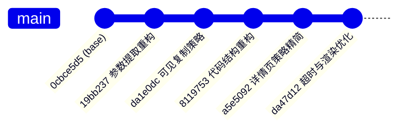
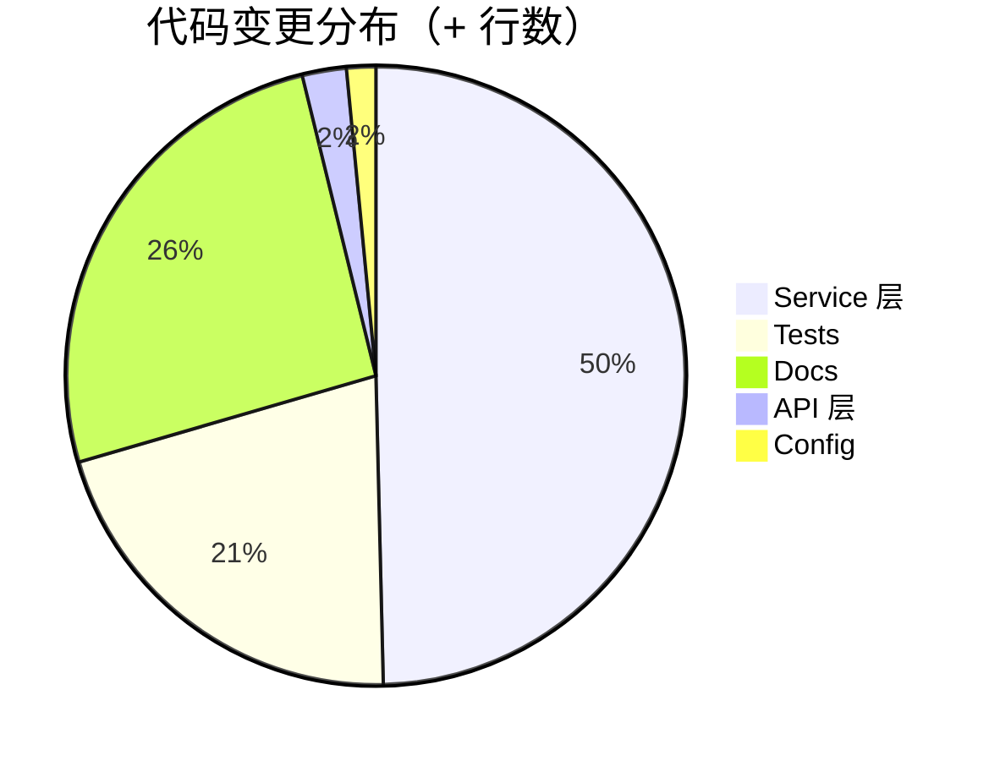
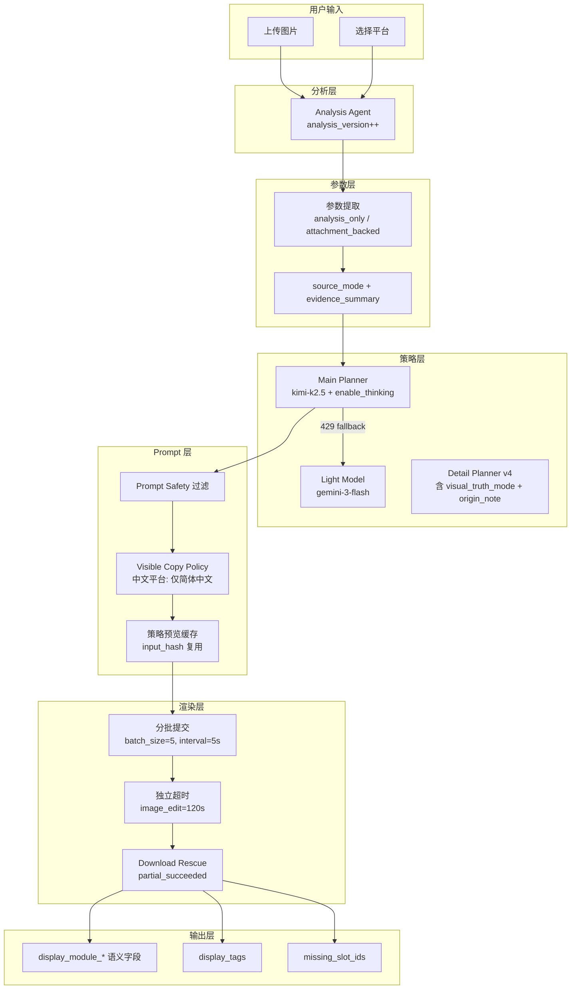
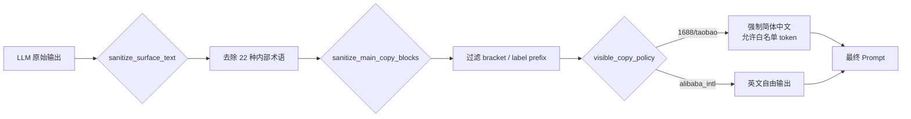
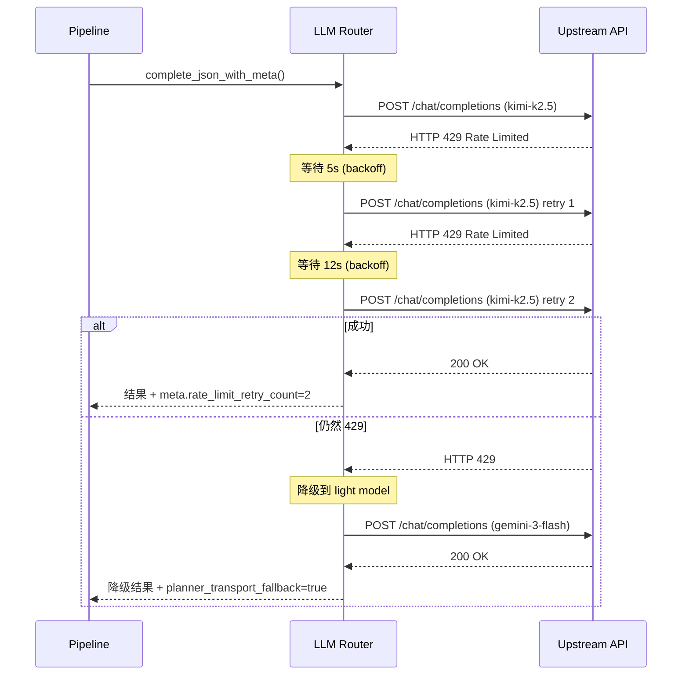
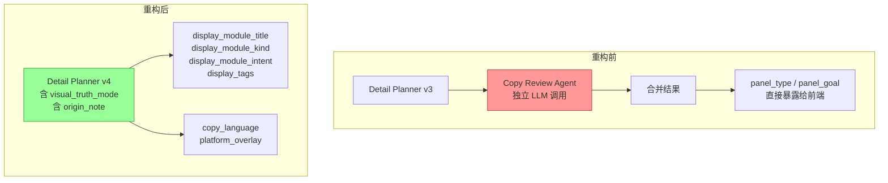
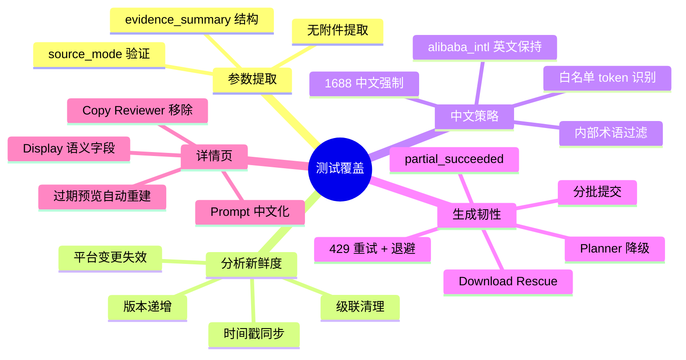
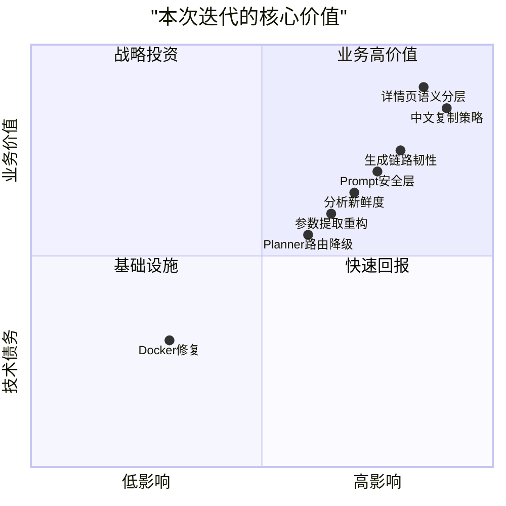

# SmartPhoto Backend — feature_free-sign 分支工作总结

> **基准提交**: `0cbce5d5` → **HEAD**: `da47d12`
> **时间跨度**: 2026-03-28 ~ 2026-03-30（3 天）
> **作者**: JackWPP

---

## 一、总览

本次迭代围绕 **6 大主题** 进行了系统性重构与功能增强：

| # | 主题 | 核心目标 |
|---|------|---------|
| 1 | 参数提取流程重构 | 去附件依赖，引入 Planner 路由与降级 |
| 2 | 可见复制语言策略 | 国内平台强制简体中文、智能白名单 |
| 3 | Prompt 安全层 | 统一过滤内部规划术语，防止泄露到图片 |
| 4 | 分析新鲜度契约 | 版本号 + 时间戳，解决缓存脏读问题 |
| 5 | 详情页语义分层 | 内部字段 vs 用户展示字段分离 |
| 6 | 生成链路韧性 | 429 重试、分批提交、部分成功、超时调优 |

---

## 二、工作量统计

### 2.1 整体数据

| 指标 | 数值 |
|------|------|
| 变更文件 | **39** |
| 新增行数 | **+5,797** |
| 删除行数 | **−657** |
| 净增行数 | **+5,140** |
| 提交数 | **5** |
| 新增测试函数 | **32** |
| 新增服务函数 | **88** |
| 新增文件 | **7** |

### 2.2 按模块分布

| 模块 | 文件数 | 新增行 | 删除行 | 关键文件 |
|------|--------|--------|--------|---------|
| **Service 层** | 9 | +2,798 | −492 | `detail_pages.py`, `pipeline.py`, `upstream.py`, `llm_router.py`, `prompt_safety.py`(新), `visible_copy_policy.py`(新) |
| **Tests** | 4 | +1,177 | −6 | `test_integration.py`, `test_upstream.py`, `test_worker_tasks.py` |
| **Docs** | 10 | +1,448 | −95 | `API联调指南.md`, `提示词汇总.md`(新), `详情页前端改造说明_20260330.md`(新) |
| **API 层** | 3 | +130 | −20 | `sessions.py`, `uploads.py` |
| **Config** | 4 | +86 | −39 | `config.py`, `.env.example`, `docker-compose.prod.yml` |

### 2.3 各提交明细

| 提交 | 日期 | 变更文件 | + 行 | − 行 | 摘要 |
|------|------|---------|------|------|------|
| `19bb237` | 03-28 | 20 | +1,011 | −241 | 参数提取重构、Planner 路由、降级策略 |
| `da1e0dc` | 03-30 | 1 | +163 | −0 | 新建 visible_copy_policy 服务 |
| `8119753` | 03-30 | 30 | +2,880 | −310 | Prompt 安全层、新鲜度契约、429 韧性、中文迁移 |
| `a5e5092` | 03-30 | 13 | +104 | −189 | 移除详情页 Copy Review Agent、文案约束精细化 |
| `da47d12` | 03-30 | 23 | +1,831 | −109 | 超时调优、分批提交、详情页中文策略、展示语义层 |

---

## 三、架构变更

### 3.1 整体数据流（重构后）

### 3.2 Prompt 安全过滤链

### 3.3 429 限流与降级流程

### 3.4 详情页渲染流程（重构后）

---

## 四、详细变更说明

### 4.1 参数提取流程重构

**影响文件**: `pipeline.py`, `llm_router.py`, `upstream.py`, `config.py`, `schemas/session.py`

**变更内容**:
- 移除了参数提取对附件的强制依赖，改为支持 `analysis_snapshot` + `session_images` 作为输入源
- 引入 `source_mode`（`analysis_only` / `attachment_backed`）和 `evidence_summary` 字段
- 新增 `complete_json_with_meta()` 方法，返回路由元数据（provider、model、retry 信息）
- Planner 模型切换：`gemini-3-pro` → `kimi-k2.5`（自动启用 `enable_thinking`）
- 新增 `planner_profile` 配置，支持 `harness_first` / `light_model` 双模式

**好处**:
1. **用户体验提升**: 用户无需上传参数附件即可完成参数提取，降低使用门槛
2. **成本降低**: `kimi-k2.5` 替代 `gemini-3-pro`，Thinking 模式提升规划质量
3. **可观测性增强**: 路由元数据让每次 LLM 调用可追踪

---

### 4.2 可见复制语言策略（新服务）

**新增文件**: `app/services/visible_copy_policy.py`（194 行）

**变更内容**:
- 新建 `SIMPLIFIED_CHINESE_VISIBLE_COPY_PLATFORM_IDS` 常量（1688、taobao、jd、pdd、douyin、xiaohongshu、custom）
- 实现 `build_visible_text_allowlist()`：从确认的文案数据中提取合法拉丁 token（型号、缩写）
- 实现 `filter_disallowed_latin_tokens()`：过滤非白名单英文词汇
- 智能白名单机制：含数字的 token 通过（如 `H13`、`USB-C`），纯大写 2-16 字母通过（如 `HEPA`、`CADR`），29 种通用单位缩写始终允许

**好处**:
1. **合规性**: 国内电商平台商品图必须以中文为主，英文仅限技术参数
2. **智能化**: 白名单从用户文案数据动态生成，无需手动维护
3. **可扩展**: 新增平台只需加入 `SIMPLIFIED_CHINESE_VISIBLE_COPY_PLATFORM_IDS` 集合

---

### 4.3 Prompt 安全层（新服务）

**新增文件**: `app/services/prompt_safety.py`（269 行）

**变更内容**:
- 定义 `PROMPT_MATRIX_GUARDRAILS`：3 条中文守卫规则
- 定义 `_INTERNAL_PROMPT_TERM_PATTERNS`：22+ 种正则模式，覆盖 `proof`、`panel_goal`、`copy_focus`、`narrative_section`、`design proof` 等中英文内部术语
- 实现 `sanitize_surface_text()`：剥离内部术语、方括号包装、标签前缀
- 实现 `sanitize_main_copy_blocks()` / `sanitize_detail_copy_blocks()`：对 copy blocks 进行批量清洗
- 实现 `sanitize_copy_form_payload()` / `sanitize_parameter_snapshot()`：在 API 入口和 LLM 输出处统一清洗
- 所有 LLM Agent 的 system prompt 均注入 guardrail 文本

**好处**:
1. **品牌安全**: 防止内部规划术语（如 `[design proof]`、`panel_goal`）出现在生成的商品图片上
2. **一致性**: 全链路统一的过滤入口，不再散落在各服务中
3. **可维护**: 新增过滤规则只需修改 `_INTERNAL_PROMPT_TERM_PATTERNS` 一个地方

---

### 4.4 分析新鲜度契约

**影响文件**: `alembic/versions/20260330_0016_analysis_freshness_contract.py`, `models/session.py`, `pipeline.py`, `sessions.py`

**变更内容**:
- 数据库新增 3 列：`analysis_version`（Integer）、`analysis_updated_at`（DateTime）、`latest_analysis_job_id`
- `run_analysis_job` 成功后自动递增 `analysis_version` 并更新时间戳
- 新增 `_clear_analysis_downstream_outputs()`：清除因分析失效而脏读的下游数据（parameter_snapshot、strategy_preview 等）
- 平台变更触发 `_invalidate_analysis_outputs`，标记 `reanalysis_required=true`

**好处**:
1. **缓存一致性**: 前端通过版本号判断是否需要刷新，避免展示过期分析结果
2. **级联清理**: 分析失效后自动清除下游参数和策略数据，防止基于过期分析的生成
3. **可追溯**: `latest_analysis_job_id` 关联到具体的异步任务

---

### 4.5 详情页语义分层

**影响文件**: `detail_pages.py`, `upstream.py`, `schemas/session.py`, `schemas/results.py`

**变更内容**:
- **移除 Detail Copy Review Agent**：合并到 Detail Planner v4 中，减少一次 LLM 调用
- 新增 `display_module_title`：用户友好标题（如"首屏亮点"、"场景价值"、"收尾总结"）
- 新增 `display_module_kind`：模块类型描述
- 新增 `display_module_intent`：模块意图说明
- 新增 `display_tags`：去重后的用户安全标签列表
- 内部字段（`panel_type`、`panel_goal`、`copy_focus`、`visual_truth_mode`）不再暴露给前端
- 过期预览自动重建：检测 `language_policy_version`、`detail_policy_version`、`copy_language` 不匹配时自动重建
- Prompt 全面中文化：所有详情页 prompt 模板从英文迁移为中文

**好处**:
1. **延迟降低**: 移除一次 LLM 调用，详情页策略预览延迟减少约 40-60%
2. **前端友好**: 语义化字段让前端直接使用，无需理解内部规划术语
3. **自动迁移**: 旧版预览自动升级为新格式，无需前端手动触发

---

### 4.6 生成链路韧性

**影响文件**: `pipeline.py`, `upstream.py`, `llm_router.py`, `config.py`, `.env.example`

**变更内容**:

| 配置项 | 旧值 | 新值 | 说明 |
|--------|------|------|------|
| `WHATAI_REQUEST_TIMEOUT_SECONDS` | 180 | **90** | 通用请求超时缩短 |
| `WHATAI_IMAGE_EDIT_TIMEOUT_SECONDS` | — | **120**（新增） | 图片编辑独立超时 |
| `IMAGE_SUBMIT_BATCH_SIZE` | — | **5**（新增） | 分批提交数量 |
| `IMAGE_SUBMIT_BATCH_INTERVAL_SECONDS` | — | **5**（新增） | 批次间隔 |
| `IMAGE_POLL_INITIAL_DELAY_SECONDS` | — | **45**（新增） | 首次轮询延迟 |
| Poll Profile | `5s×6 + 10s×12 + 15s×20` | `10s×6 + 15s×8 + 20s×10` | 更慢的起始轮询 |

- **分批提交**: 渲染任务按 5 张一批提交，间隔 5 秒，避免瞬间冲击上游 API
- **Download Rescue**: 单个 slot 下载失败自动重试 1 次，不再影响整体任务
- **partial_succeeded**: 部分成功时返回 `missing_slot_ids`，前端可仅重试失败 slot
- **429 重试**: 指数退避（5s → 12s → 25s），支持 `Retry-After` header
- **Planner 降级**: 主 planner 不可用时自动降级到 light model 或 rule-based fallback
- **Docker 修复**: `docker-compose.prod.yml` 中所有 command 改为 `["bash", "./scripts/..."]`，解决容器内执行权限问题

**好处**:
1. **稳定性大幅提升**: 429 和超时不再直接导致任务失败
2. **上游友好**: 分批 + 延迟轮询减少对图片生成 API 的并发压力
3. **用户体验**: 部分成功比全部失败好得多，前端可仅补充缺失图片
4. **生产可靠**: Docker 修复消除了容器启动失败风险

---

## 五、测试覆盖

### 5.1 测试统计

| 测试文件 | 新增行 | 新增测试函数 | 覆盖范围 |
|---------|--------|-------------|---------|
| `test_integration.py` | +414 | 12 | API 端到端、新鲜度契约、中文策略、自动重建、内部术语过滤 |
| `test_upstream.py` | +444 | 14 | 超时配置、中文约束、白名单构建、429 重试、kimi thinking、详情页 prompt |
| `test_worker_tasks.py` | +323 | 8 | Worker 异步任务、新鲜度递增、分批提交、Rescue、语言校验 |
| `test_user_features.py` | +2 | 增强 | 上传后新鲜度保持断言 |
| **合计** | **+1,183** | **34** | |

### 5.2 测试覆盖的关键场景

---

## 六、文档更新

| 文档 | 变更 | 关键更新点 |
|------|------|-----------|
| `API联调指南.md` | +144/-30 | 新鲜度字段、参数提取重构、中文约束、batch 提交、partial_succeeded |
| `生图Agent协作逻辑.md` | +141/-30 | Agent 角色更新、Planner 降级、Copy Reviewer 移除 |
| `运行与排障手册.md` | +120 | 超时配置、429 处理、Docker 修复 |
| `提示词汇总.md` | 新建 727 行 | 全量 LLM Agent Prompt 清单、安全过滤规则、版本常量 |
| `详情页前端改造说明_20260330.md` | 新建 309 行 | 前端迁移指南、字段映射、自测清单 |
| `生产上线SOP.md` | +13/-7 | Docker CMD 修复 |
| `openapi.json` | +83/-8 | Schema 字段更新 |

---

## 七、核心收益总结

| 收益维度 | 具体成果 |
|---------|---------|
| **延迟降低** | 详情页策略预览减少 1 次 LLM 调用（~40-60% 延迟降低） |
| **稳定性提升** | 429/超时不再导致任务全量失败，支持 partial_succeeded |
| **合规性** | 国内平台图片强制简体中文，白名单机制兼顾技术参数 |
| **品牌安全** | 45+ 种内部规划术语统一过滤，杜绝泄露到商品图片 |
| **用户体验** | 前端字段语义化（display_module_*），过期数据自动重建 |
| **可观测性** | 路由元数据、新鲜度版本号、批次提交事件全面可追踪 |
| **成本优化** | 模型切换（kimi-k2.5），策略预览缓存复用（input_hash） |
| **生产可靠** | Docker 执行权限修复、分批提交降低上游压力 |

---

## 八、提交列表

| Hash | Message | Date |
|------|---------|------|
| `19bb237` | feat: Refactor parameter extraction and completion process | 2026-03-28 |
| `da1e0dc` | feat: 添加可见复制策略服务，支持简体中文和拉丁字符处理 | 2026-03-30 |
| `8119753` | Refactor code structure for improved readability and maintainability | 2026-03-30 |
| `a5e5092` | Refactor detail page strategy preview and remove copy review agent | 2026-03-30 |
| `da47d12` | feat: Add new timeout settings and improve detail page rendering | 2026-03-30 |
