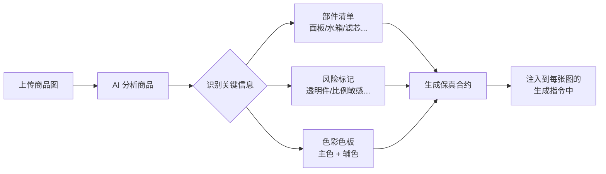
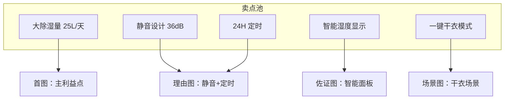
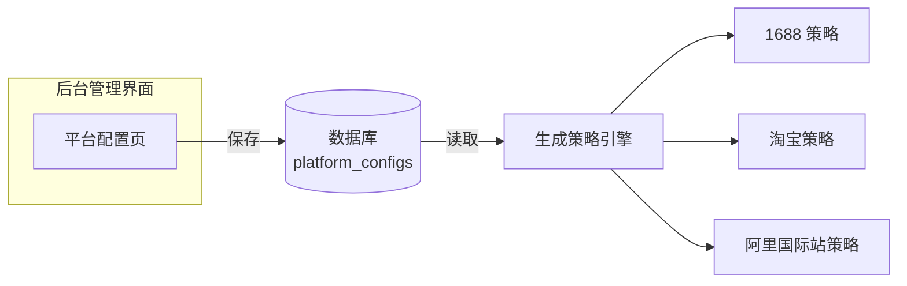
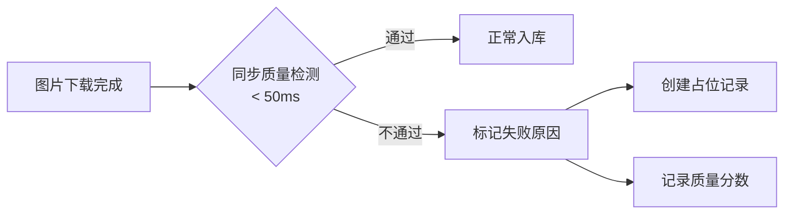
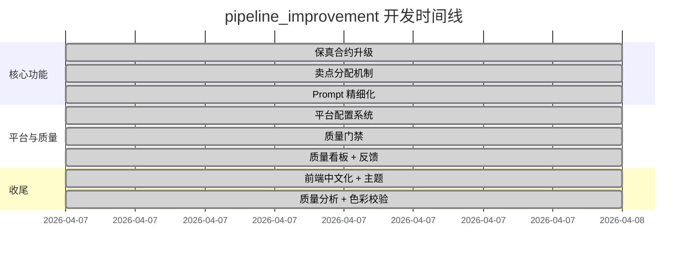
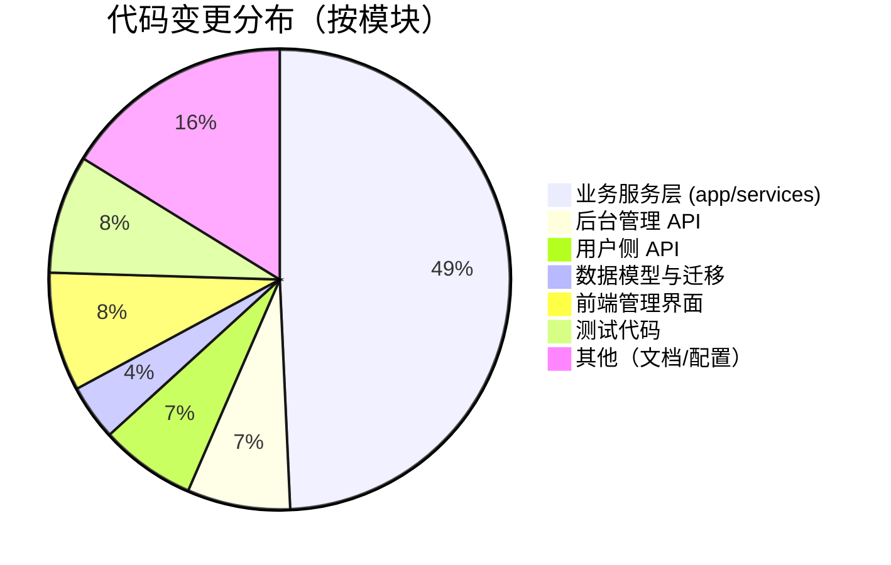

# Pipeline Improvement 工作总结

> 时间范围：2026-04-07
> 分支：`pipeline_improvement`
> 提交范围：`8d682c1` → `e8de203`（共 7 次提交）

---

## 一、工作量概览

| 指标 | 数据 |
|------|------|
| 总提交数 | 7 |
| 涉及文件数 | 60 |
| 新增代码行 | +4,424 |
| 删除代码行 | -199 |
| 净增代码行 | +4,225 |
| 新增 Python 模块 | 8 个 |
| 新增数据库迁移 | 3 个 |
| 新增前端页面 | 1 个（平台配置管理） |
| 新增/更新测试 | 4 个文件，+368 行 |

---

## 二、做了哪些事

### 1. "保真合约"升级——让 AI 更忠实于商品原貌

**问题**：之前 AI 生成的商品图有时会"跑偏"——把除湿机的控制面板画错了位置、透明水箱变成了不透明的、产品比例也不对。

**我们做了什么**：

- 分析环节现在会自动识别产品的**关键部件**（控制面板、水箱、滤芯等），并给每个部件打上"位置标记"
- 为每个产品生成一份**风险清单**，标记哪些地方容易出错（比如透明件、比例敏感的产品）
- 为每个生成槽位（首图、卖点图、场景图等）生成**部件锁**——告诉 AI "这些部件必须保持原样"
- 增加**色彩保真**校验：提取产品的主色调，确保生成图的颜色不会偏移太多
- 增加**品牌标识保护**：保证 logo、铭牌等不被篡改

### 2. 卖点分配——每张图说不同的话

**问题**：之前 5 张主图可能会重复提到同一个卖点，信息密度低。

**我们做了什么**：

- 实现**卖点独占分配**：每个卖点只会被分配给最合适的一张图
- 策略规划时，系统会为每个槽位分配不同的"任务"，比如首图说主利益点、理由图说 2 个不同维度、佐证图展示参数证据

### 3. 平台配置系统——运营人员可自行调整

**问题**：每个电商平台（1688、淘宝、阿里国际站）对图片的要求不同，之前改配置需要改代码重新部署。

**我们做了什么**：

- 新增**数据库驱动的平台配置系统**：运营人员可以在后台管理界面直接调整每个平台的生成策略
- 可配置项包括：
  - 首图文字策略（极简 / 适中 / 丰富）
  - 是否强制白底
  - 默认图片数量和比例
  - 禁止出现的元素
  - 补充到负面提示词的内容
  - 额外约束条件
- 新增后台管理页面 `PlatformConfigsView`，支持完整的增删改查

### 4. 图片质量门禁——生成后自动检测

**问题**：AI 有时会生成异常图片（全白、全黑、模糊、尺寸不足），之前要到用户下载后才发现。

**我们做了什么**：

- 新增**同步质量检测**，每张图下载后立即检查（< 50ms/张）：
  - 图片是否能正常解码
  - 尺寸是否达标（≥ 1024px）
  - 是否全白/全黑/信息量极低
  - 白底图的背景是否够白
- 检测不通过的图片会标记原因，并创建占位记录，方便运营排查
- 检测结果写入 `quality_status`、`quality_scores`、`failure_reason` 字段

### 5. 质量分析看板——数据驱动的改进

**问题**：之前缺乏系统性的质量数据，不知道哪个平台、哪个品类、哪个槽位的图片质量有问题。

**我们做了什么**：

- 新增**质量分析服务**，按平台/品类/槽位维度聚合质量数据
- 后台新增质量看板接口，展示：
  - 整体通过率
  - 失败原因分布（尺寸不足、全白、信息量低等）
  - 用户反馈统计
- 新增**用户反馈接口**：前端可以对每张图打分（好/一般/差）并标注问题类型（变形/颜色不对/文字错误等）
- 新增**颜色保真校验模块**：使用 CIELAB 色彩空间计算色差，确保产品颜色不被改变

### 6. Prompt 提示词精细化

**问题**：AI 生成的图片有时会出现不该有的文字、背景杂乱、布局不合理等问题。

**我们做了什么**：

- 强化了各平台的提示词约束：
  - 明确禁止出现的元素（水印、边框、二维码等）
  - 负面提示词（告诉 AI 不要生成什么）
  - 首图文字策略的精细控制
- 增强了光照/背景/间距的指令细节
- 参考图数量上限调整为 8 张，避免信息过载

### 7. 后台管理界面升级

- **全部中文化**：导航栏、页面标题、操作按钮全部改为中文
- **视觉主题刷新**：从暖棕色升级为现代玻璃态紫色主题
- **新增平台配置页**：可视化编辑各平台的生成策略
- **JSON 编辑器增强**：支持更友好的配置编辑体验

### 8. 代码架构优化

- **上游服务拆分**：将 `upstream.py` 拆分为 `upstream_analysis`、`upstream_image`、`upstream_planner` 三个独立模块，降低单个文件的复杂度
- **品类库增强**：新增 `confusion_pairs`（容易混淆的品类对）和 `expected_components`（该品类预期包含的部件），帮助分析更准确
- **数据库迁移**：3 个新迁移，确保数据库结构与代码一致

---

## 三、工作节奏

---

## 四、文件变更分布

---

## 五、新增模块一览

| 模块 | 文件 | 职责 |
|------|------|------|
| 质量门禁 | `app/services/quality_gate.py` | 生成图片的快速质量检测 |
| 质量分析 | `app/services/quality_analytics.py` | 按维度聚合质量数据 |
| 质量信号 | `app/services/quality_signals.py` | 保真合约、风险标记、部件锁 |
| 颜色校验 | `app/services/color_validation.py` | CIELAB 色差对比 |
| 平台配置模型 | `app/models/platform_config.py` | 平台配置的数据库模型 |
| 资产反馈模型 | `app/models/asset_feedback.py` | 用户反馈的数据库模型 |
| 反馈 API | `app/api/v2/feedback.py` | 用户评分与问题标注接口 |
| 上游门面模块 | `app/services/upstream_*.py` | 上游服务拆分，降低复杂度 |
