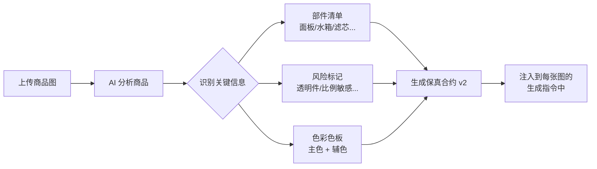
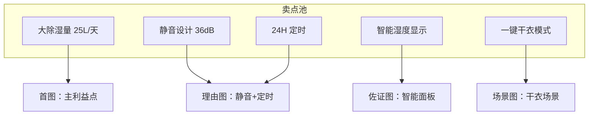
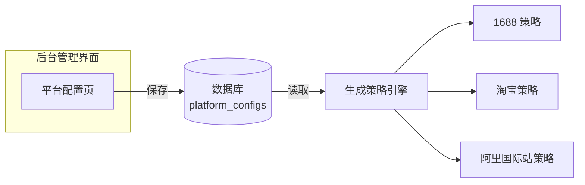
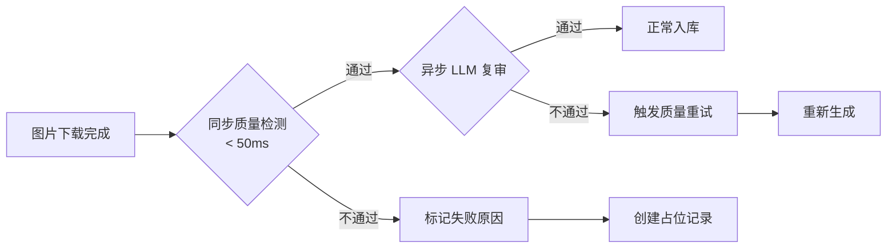
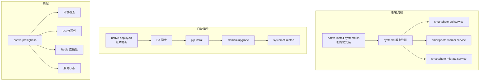
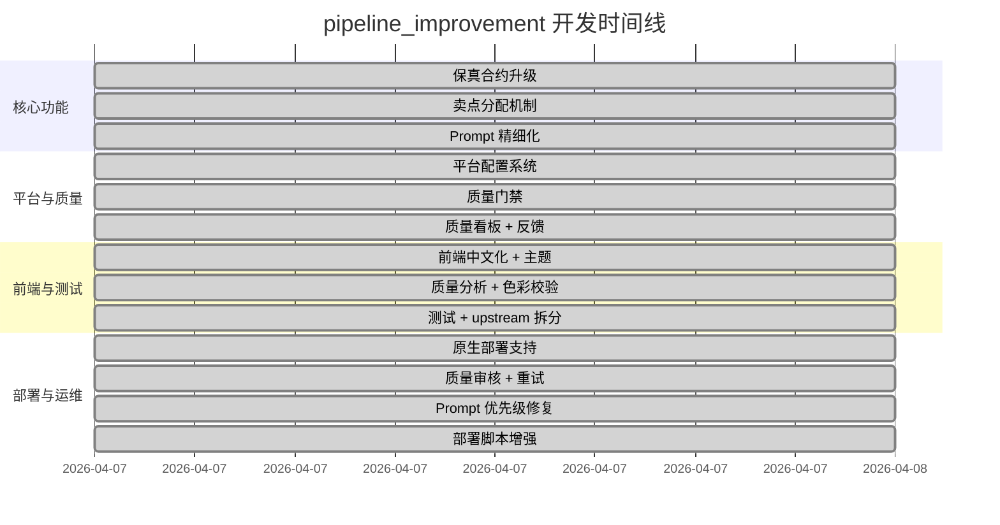
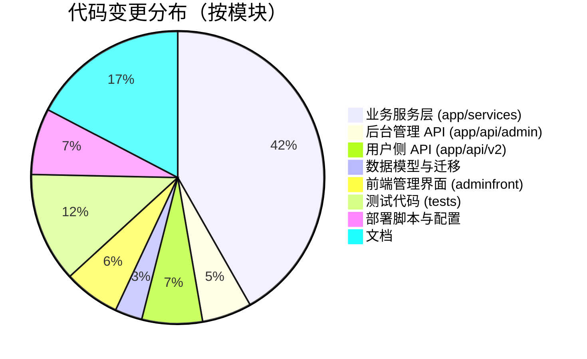

# Pipeline Improvement 工作总结

> 时间范围：2026-04-06 ~ 2026-04-07
> 分支：`pipeline_improvement`
> 提交范围：`8d682c1` → `c2ff502`（共 11 次提交）
> 作者：JackWPP

---

## 一、工作量概览

| 指标 | 数据 |
|------|------|
| 总提交数 | **11** |
| 涉及文件数 | **80** |
| 新增代码行 | **+6,936** |
| 删除代码行 | **−258** |
| 净增代码行 | **+6,678** |
| 新增 Python 模块 | **10 个** |
| 新增数据库迁移 | **4 个** |
| 新增前端页面 | **1 个**（平台配置管理） |
| 新增部署脚本 | **3 个** |
| 新增 systemd 服务 | **3 个** |
| 新增/更新测试 | **4 个文件，+721 行** |

---

## 二、做了哪些事

### 1. "保真合约"升级——让 AI 更忠实于商品原貌

**问题**：之前 AI 生成的商品图有时会"跑偏"——把除湿机的控制面板画错了位置、透明水箱变成了不透明的、产品比例也不对。

**我们做了什么**：

- 分析环节现在会自动识别产品的**关键部件**（控制面板、水箱、滤芯等），并给每个部件打上"位置标记"
- 为每个产品生成一份**风险清单**，标记哪些地方容易出错（比如透明件、比例敏感的产品）
- 为每个生成槽位（首图、卖点图、场景图等）生成**部件锁**——告诉 AI "这些部件必须保持原样"
- 增加**色彩保真**校验：提取产品的主色调（最多 6 色），使用专业 CIELAB 色彩空间计算色差
- 增加**品牌标识保护**：保证 logo、铭牌等不被篡改
- 为**结构敏感型产品**（除湿机、加湿器、空气净化器、净水器、智能门锁、电动牙刷等）自动提升保真等级

**关键文件**：`app/services/quality_signals.py`、`app/services/prompts.py`、`app/services/pipeline.py`

---

### 2. 卖点分配——每张图说不同的话

**问题**：之前 5 张主图可能会重复提到同一个卖点，信息密度低。

**我们做了什么**：

- 实现**卖点独占分配**：每个卖点只会被分配给最合适的一张图
- 策略规划时，系统会为每个槽位分配不同的"任务"，确保信息覆盖面最大化
- 分配算法考虑槽位适配度和卖点优先级，自动选择最优匹配

**关键文件**：`app/services/prompts.py`（`_allocate_exclusive_selling_points`）

---

### 3. 平台配置系统——运营人员可自行调整

**问题**：每个电商平台（1688、淘宝、阿里国际站）对图片的要求不同，之前改配置需要改代码重新部署。

**我们做了什么**：

- 新增**数据库驱动的平台配置系统**：运营人员可以在后台管理界面直接调整每个平台的生成策略
- 可配置项包括：首图文字策略、白底策略、默认图片数量/比例、禁止元素、负面提示词、额外约束
- 新增后台管理页面 `PlatformConfigsView`，支持完整增删改查
- 新增 `platform_configs` 数据表，所有配置持久化存储
- 平台配置变更即时生效，无需重启服务

**关键文件**：`app/models/platform_config.py`、`app/api/admin/platform_configs.py`、`adminfront/src/views/PlatformConfigsView.vue`

---

### 4. 图片质量门禁——生成后自动检测

**问题**：AI 有时会生成异常图片（全白、全黑、模糊、尺寸不足），之前要到用户下载后才发现。

**我们做了什么**：

- 新增**同步质量检测**，每张图下载后立即检查（< 50ms/张）：
  - 图片是否能正常解码
  - 尺寸是否达标（≥ 1024px）
  - 是否全白/全黑/信息量极低
  - 白底图的背景是否够白
- 新增**异步 LLM 视觉复审**管线，对通过同步检测的图片做更精细的质量评估
- 新增**异步质量重试机制**：质量审核不通过的图片自动触发重试
- 检测不通过的图片标记原因并创建占位记录，方便运营排查
- `assets` 表新增 `quality_status`、`quality_scores`、`failure_reason`、`quality_review_job_id` 字段

**关键文件**：`app/services/quality_gate.py`、`app/services/color_validation.py`、`app/workers/tasks.py`

---

### 5. 颜色校验——专业色彩空间保真

**问题**：产品白色机身被画成灰色、红色变成橙色，颜色偏差直接影响购买决策。

**我们做了什么**：

- 实现**主色提取**：使用 K-means 聚类从商品图中提取最多 5 个主色
- 实现 **CIE76 Delta-E 色差计算**：在 CIELAB 感知均匀色彩空间中计算色差
- 默认色差容忍度 25.0 Delta-E，超出即标记为颜色偏差
- 生成**颜色修正指令**：偏差超限时自动生成修正提示词，用于质量重试
- 额外实现 SSIM 结构相似度和直方图相关性作为观察指标

**关键文件**：`app/services/color_validation.py`

---

### 6. 质量分析看板——数据驱动的改进

**问题**：之前缺乏系统性的质量数据，不知道哪个平台、哪个品类、哪个槽位的图片质量有问题。

**我们做了什么**：

- 新增**质量分析服务**，按平台/品类/槽位维度聚合质量数据
- 后台新增质量看板接口 `/api/admin/v1/dashboard/quality`
- 展示：整体通过率、失败原因分布、用户反馈统计
- 新增**用户反馈接口**：前端可以对每张图打分（好/一般/差）并标注问题类型
- 反馈标签包括：变形/颜色不对/文字错误/风格不对/平台违规/保真度低/其他

**关键文件**：`app/services/quality_analytics.py`、`app/api/v2/feedback.py`、`app/models/asset_feedback.py`

---

### 7. Prompt 提示词精细化与优先级修复

**问题**：
1. AI 生成的图片有时出现不该有的文字、背景杂乱、布局不合理
2. 用户修改文案覆盖后重新生成时，系统仍使用旧的缓存值

**我们做了什么**：

- 强化各平台提示词约束：禁止元素列表、负面提示词、首图文字策略精细控制
- 增强光照/背景/间距的指令细节
- 参考图上限调整为 8 张
- **修复 copy_blocks 优先级**：当 `plan_item` 显式传入（如单图重生成）时，其 `copy_blocks` 优先于缓存中的 `prompt_plan.copy_blocks`
- **修复策略归一化**：`copy_blocks` 和 `raw_prompt_override` 在归一化过程中正确保留，确保用户自定义不被覆盖

**关键文件**：`app/services/prompts.py`、`app/services/strategy.py`、`app/api/v2/sessions.py`

---

### 8. 后台管理界面升级

- **全部中文化**：导航栏、页面标题、操作按钮全部改为中文，降低使用门槛
- **全新视觉主题**：从暖棕色更新为现代玻璃态紫色主题（glassmorphism）
- **新增平台配置页**：可视化编辑各平台的生成策略，无需懂 JSON
- **JSON 编辑器增强**：更友好的配置编辑体验

**关键文件**：`adminfront/src/style.css`、`adminfront/src/views/PlatformConfigsView.vue`、`adminfront/src/router/index.js`

---

### 9. 原生部署支持——不依赖 Docker 的生产方案

**问题**：部分客户环境无法使用 Docker，需要原生 Linux 部署方案。

**我们做了什么**：

- 新增 **systemd 服务模板**：API / Worker / Migrate 三个独立服务
- 新增**部署脚本**：
  - `native-deploy.sh`：一键部署（Git 同步 → 虚拟环境 → 依赖安装 → 迁移 → 重启）
  - `native-install-systemd.sh`：安装 systemd 服务（自动创建服务用户、渲染模板）
  - `native-preflight.sh`：发布前预检（环境配置、数据库、Redis、服务状态）
- 新增 `docker-compose.infra.yml`：仅启动 PostgreSQL + Redis 基础设施
- 新增 `.env.prod.native.example`：94 项生产配置模板
- 支持**动态路径**：所有脚本和服务模板通过 `APP_ROOT`、`SHARED_ROOT` 环境变量灵活配置部署路径
- 支持**动态用户**：通过 `SERVICE_USER`、`SERVICE_GROUP` 配置运行身份

**关键文件**：
- `deploy/systemd/smartphoto-{api,worker,migrate}.service`
- `scripts/native-deploy.sh`、`scripts/native-install-systemd.sh`、`scripts/native-preflight.sh`
- `docker-compose.infra.yml`、`.env.prod.native.example`

---

### 10. 代码架构优化

- **上游服务拆分**：将 `upstream.py` 拆分为 `upstream_analysis`、`upstream_image`、`upstream_planner` 三个独立模块，降低单文件复杂度
- **品类库增强**：新增 `confusion_pairs`（易混淆品类对）和 `expected_components`（预期部件），帮助分析更准确
- **4 个数据库迁移**确保结构与代码同步

---

## 三、工作节奏

---

## 四、文件变更分布

---

## 五、新增模块一览

| 模块 | 文件 | 职责 |
|------|------|------|
| 质量门禁 | `app/services/quality_gate.py` | 生成图片的快速质量检测（< 50ms） |
| 质量分析 | `app/services/quality_analytics.py` | 按维度聚合质量数据 |
| 质量信号 | `app/services/quality_signals.py` | 保真合约、风险标记、部件锁 |
| 颜色校验 | `app/services/color_validation.py` | CIELAB Delta-E 色差对比 |
| 平台配置模型 | `app/models/platform_config.py` | 平台配置的数据库模型 |
| 资产反馈模型 | `app/models/asset_feedback.py` | 用户反馈的数据库模型 |
| 反馈 API | `app/api/v2/feedback.py` | 用户评分与问题标注接口 |
| 平台配置 API | `app/api/admin/platform_configs.py` | 后台平台配置 CRUD |
| 上游门面模块 | `app/services/upstream_*.py` | 上游服务拆分（分析/图片/策略） |
| 部署脚本 | `scripts/native-*.sh` | 原生部署/安装/预检 |

---

## 六、新增 API 接口

| 接口 | 方法 | 用途 |
|------|------|------|
| `/api/v2/assets/{id}/feedback` | POST | 提交图片反馈 |
| `/api/v2/assets/{id}/feedback` | GET | 查看图片反馈 |
| `/api/admin/v1/platform-configs` | GET | 列出平台配置 |
| `/api/admin/v1/platform-configs` | POST | 新建平台配置 |
| `/api/admin/v1/platform-configs/{id}` | GET | 获取单个配置 |
| `/api/admin/v1/platform-configs/{id}` | PUT | 更新平台配置 |
| `/api/admin/v1/platform-configs/{id}` | DELETE | 删除平台配置 |
| `/api/admin/v1/dashboard/quality` | GET | 质量看板数据 |

---

## 七、数据库迁移

| 迁移文件 | 说明 |
|----------|------|
| `20260407_0017_category_catalog_extra_fields.py` | 品类库增加 `confusion_pairs`、`expected_components` |
| `57aaaca5967c_add_platform_configs_table.py` | 新增 `platform_configs` 表 |
| `575351136703_add_asset_quality_and_feedback.py` | `assets` 增加质量字段，新增 `asset_feedback` 表 |
| `20260407_0018_merge_dual_heads.py` | 合并双头迁移 |

---

## 八、完整提交记录

| # | 提交 | 说明 |
|---|------|------|
| 1 | `c523ef2` | 保真合约 v2：部件锁、色彩色板、品牌标识保护、卖点独占分配 |
| 2 | `cb2fad3` | 平台配置系统：数据库驱动、后台 CRUD 管理接口 |
| 3 | `e0c2135` | 质量门禁：同步图片质量检测、异步 LLM 视觉复审 |
| 4 | `741fabc` | 资产反馈 API 与质量看板接口 |
| 5 | `2cc4391` | 后台前端中文化、紫色主题刷新、平台配置管理页面 |
| 6 | `4884af8` | 测试更新、上游服务模块拆分 |
| 7 | `e8de203` | 质量分析服务、CIELAB 颜色校验、可靠性修复 |
| 8 | `def1809` | 原生部署支持：systemd 服务 + 部署脚本 + 基础设施 compose |
| 9 | `ab629e6` | 质量审核：颜色验证 + 异步质量重试机制 |
| 10 | `a419b41` | 会话/策略优先级修复，Prompt copy_blocks 覆盖逻辑修正 |
| 11 | `c2ff502` | 系统服务动态路径/用户配置，部署脚本增强 |
