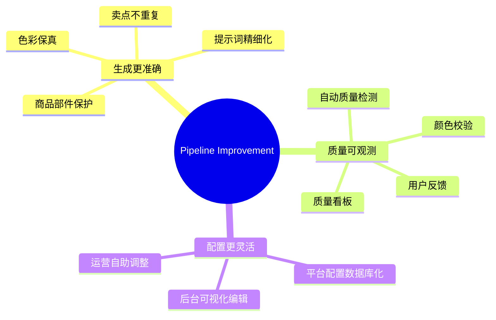
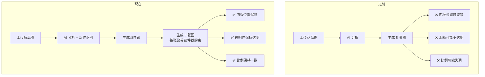
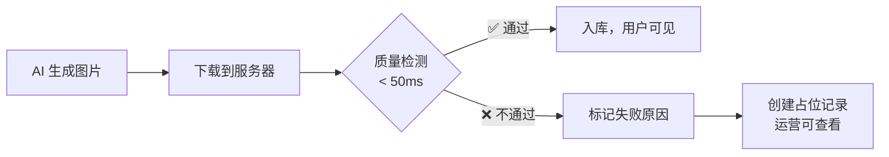
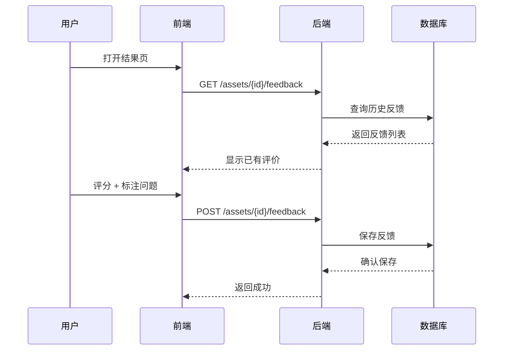
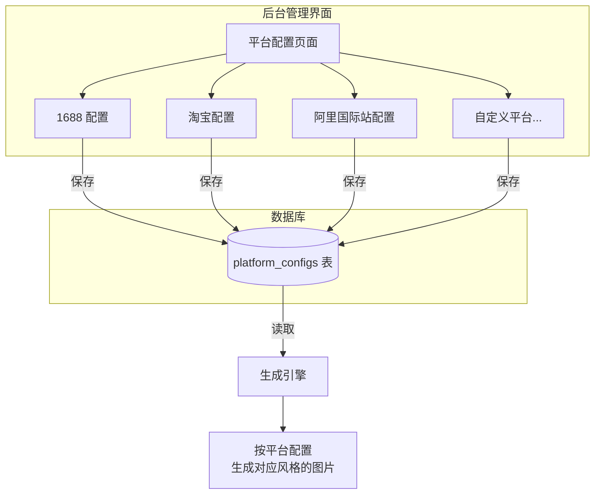

# SmartPhoto Backend v2 — Pipeline Improvement 版本更新说明

> 版本分支：`pipeline_improvement`
> 更新日期：2026-04-07
> 提交范围：`8d682c1` → `e8de203`

---

## 本次更新一句话总结

**让 AI 生成的商品图更像产品本身，且生成质量可观测、可管理。**

---

## 更新概览

本次更新围绕三个核心方向：



---

## 一、生成更准确

### 1.1 商品部件保护

**解决了什么问题**：AI 画除湿机时控制面板跑到了背面、透明水箱变成了不透明外壳、按钮位置不对——这些"跑偏"让产品图片没法用。

**现在的做法**：

系统在分析商品图时，会自动识别产品的关键部件（控制面板、水箱、滤芯、出风口等），并为每个部件锁定位置。在生成每张图时，这些"部件锁"会写入生成指令，确保 AI 不会随意改动。



**适用产品**：特别关注结构敏感型产品（除湿机、加湿器、空气净化器、净水器、智能门锁、电动牙刷等），这些产品的结构细节尤其不能出错。

### 1.2 色彩保真

**解决了什么问题**：产品的白色机身被画成了灰色、红色变成了橙色——颜色偏差影响购买决策。

**现在的做法**：

- 分析环节自动提取产品的**主色色板**（最多 6 个颜色）
- 生成每张图时，色板信息会作为约束写入提示词
- 新增颜色校验模块，使用专业色彩空间（CIELAB）计算色差，确保颜色偏差在可接受范围内

### 1.3 卖点不重复

**解决了什么问题**：5 张主图里有 3 张都在说"大除湿量"，信息密度低，浪费了宝贵的展示位。

**现在的做法**：

系统维护一个"卖点池"，每个卖点只会分配给最合适的一张图：

| 槽位 | 任务 | 典型分配 |
|------|------|----------|
| 首图 | 说主利益点 | "25L/天大除湿量" |
| 理由图 | 说 2 个不同理由 | "静音 36dB" + "24H 定时" |
| 佐证图 | 展示参数证据 | "智能湿度数显" |
| 场景图 | 展示使用场景 | "一键干衣模式" |
| 尾屏 | 总结收口 | 综合卖点汇总 |

### 1.4 提示词精细化

- 每个平台可以有独立的**禁止元素列表**（如水印、边框、二维码）
- 支持平台级**负面提示词**（告诉 AI 不要画什么）
- 首图文字策略从"统一配置"改为"每个平台独立设定"
- 光照、背景、间距的指令更详细

---

## 二、质量可观测

### 2.1 自动质量检测

每张图下载后自动检测，整个过程不到 50 毫秒：

| 检测项 | 说明 | 判定标准 |
|--------|------|----------|
| 能否解码 | 文件是否损坏 | 能正常打开 |
| 尺寸达标 | 分辨率够不够 | ≥ 1024 × 1024 |
| 不是空白图 | 是否全白/全黑 | 像素标准差 > 3 |
| 信息量足够 | 是否只有纯色 | 熵值 > 2.5 |
| 白底纯度 | 白底图背景是否够白 | 边缘均值 ≥ 248 |



### 2.2 用户反馈

前端新增了图片评价功能：

- **评分**：好 / 一般 / 差（3 档）
- **问题标签**：变形 / 颜色不对 / 文字错误 / 风格不对 / 平台违规 / 保真度低 / 其他
- **文字反馈**：最多 500 字



### 2.3 质量看板

后台管理界面新增质量数据看板，可以按**平台 / 品类 / 槽位**三个维度查看：

- 整体通过率趋势
- 失败原因分布（尺寸不足占多少、全白占多少...）
- 用户反馈汇总（好评率、常见问题标签）

---

## 三、配置更灵活

### 3.1 平台配置数据库化

**之前**：改平台配置需要改代码、重新打包、重新部署，周期至少半小时。

**现在**：运营人员在后台界面直接编辑，保存后立即生效。

可配置项：

| 配置项 | 说明 | 示例 |
|--------|------|------|
| 首图文字策略 | 首图上放多少字 | 极简 / 适中 / 丰富 |
| 是否强制白底 | 首图是否必须白底 | 1688=是，淘宝=否 |
| 默认图片数量 | 一次生成几张主图 | 默认 5 张 |
| 默认图片比例 | 主图的宽高比 | 1:1 |
| 禁止元素 | 不允许出现的内容 | 水印、边框、二维码 |
| 负面提示词 | AI 不要画什么 | 模糊、变形、低质量 |
| 额外约束 | 自定义约束文本 | "必须包含产品型号" |



### 3.2 后台界面升级

- **全部中文化**：导航、标题、按钮全部改为中文，降低使用门槛
- **全新视觉主题**：从暖棕色更新为现代玻璃态紫色主题
- **平台配置页**：新增可视化编辑界面，无需懂 JSON 即可调整配置
- **JSON 编辑器增强**：对于需要编辑 JSON 的场景，提供更好的编辑体验

---

## 四、技术改进

### 4.1 代码架构优化

- `upstream.py` 拆分为 3 个独立模块（分析/图片/策略），每个模块职责更清晰
- 品类库新增"易混淆品类对"和"预期部件"字段，分析更准确
- 3 个数据库迁移确保结构与代码同步

### 4.2 新增数据表

| 表名 | 用途 |
|------|------|
| `platform_configs` | 存储各平台的生成配置 |
| `asset_feedback` | 存储用户对图片的反馈 |

### 4.3 新增 API 接口

| 接口 | 方法 | 用途 |
|------|------|------|
| `/api/v2/assets/{id}/feedback` | POST | 提交图片反馈 |
| `/api/v2/assets/{id}/feedback` | GET | 查看图片反馈 |
| `/api/admin/v1/platform-configs` | GET | 列出平台配置 |
| `/api/admin/v1/platform-configs` | POST | 新建平台配置 |
| `/api/admin/v1/platform-configs/{id}` | PUT | 更新平台配置 |
| `/api/admin/v1/platform-configs/{id}` | DELETE | 删除平台配置 |
| `/api/admin/v1/dashboard/quality` | GET | 质量看板数据 |

---

## 五、升级指南

### 5.1 数据库迁移

本次包含 3 个新的 Alembic 迁移：

```
20260407_0017_category_catalog_extra_fields.py   — 品类库增加字段
20260407_0018_merge_dual_heads.py                — 合并双头迁移
57aaaca5967c_add_platform_configs_table.py       — 新增平台配置表
575351136703_add_asset_quality_and_feedback.py   — 新增质量和反馈字段
```

**必须在发布前备份数据库**，然后执行：

```bash
alembic upgrade head
```

### 5.2 新增依赖

- `numpy` — 用于质量检测和颜色校验的数值计算
- `Pillow` — 用于图片解码和像素分析

### 5.3 新增配置项

| 环境变量 | 默认值 | 说明 |
|----------|--------|------|
| 无新增必填项 | — | 所有新功能使用合理默认值 |

---

## 六、完整提交记录

| 提交 | 说明 |
|------|------|
| `c523ef2` | 保真合约 v2：部件锁、色彩色板、品牌标识保护、卖点独占分配 |
| `cb2fad3` | 平台配置系统：数据库驱动、后台 CRUD 管理接口 |
| `e0c2135` | 质量门禁：同步图片质量检测、异步 LLM 视觉复审 |
| `741fabc` | 资产反馈 API 与质量看板接口 |
| `2cc4391` | 后台前端中文化、主题刷新、平台配置管理页面 |
| `4884af8` | 测试更新、上游服务模块拆分 |
| `e8de203` | 质量分析服务、颜色校验模块、可靠性修复 |

---

## 七、后续计划

- [ ] 根据质量看板数据，持续优化各平台的生成策略
- [ ] 收集用户反馈，建立质量改进的闭环
- [ ] 扩展品类库的"预期部件"覆盖范围
- [ ] 探索更多平台的差异化配置需求
