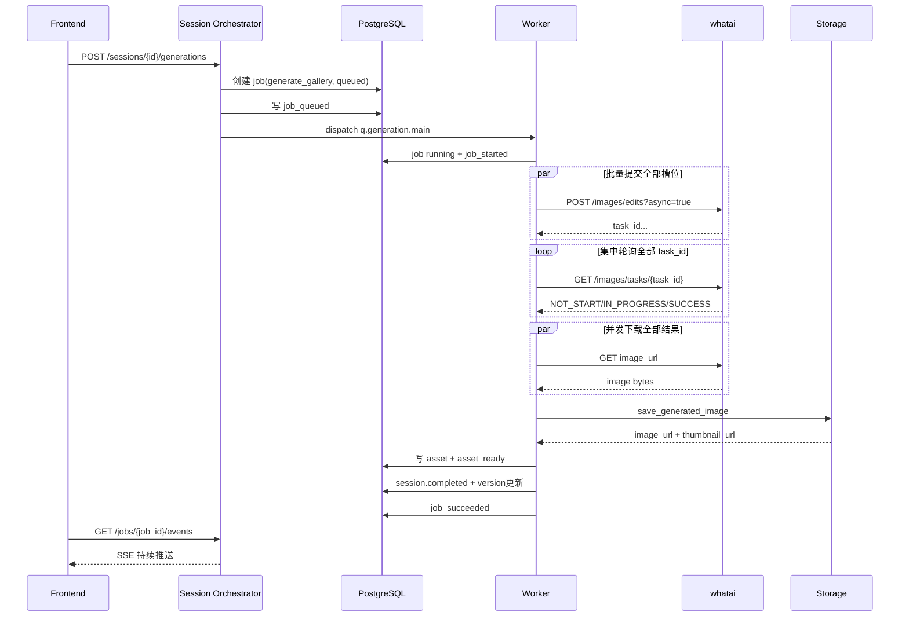
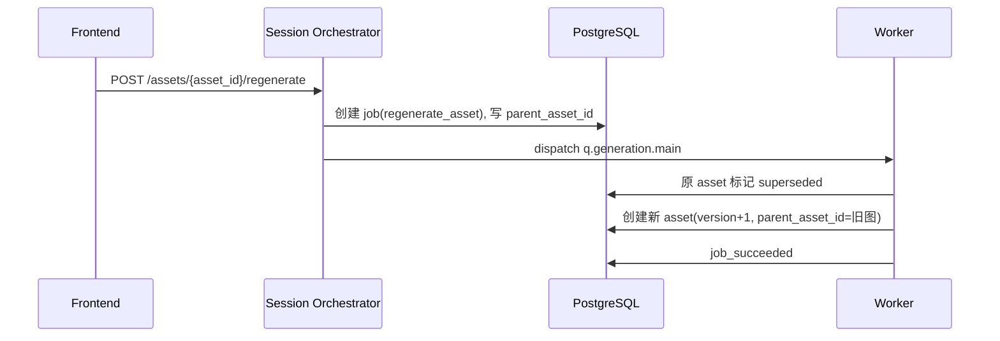

# 生图 Agent 协作逻辑（当前实现映射）

## 1. 文档定位
本文档描述的是**逻辑 Agent 协作模型**，用于指导开发、联调和排障。

说明：当前系统并未拆成多进程独立 Agent 服务，而是通过 API + Worker + Pipeline 在代码层协作执行。

## 2. Agent 拆分与代码映射
| 逻辑 Agent | 职责 | 主要代码映射 |
|---|---|---|
| Session Orchestrator | 接收请求、做前置状态校验、创建 job、分发任务 | `app/api/v2/sessions.py`, `app/api/v2/assets.py` |
| Guest Identity Agent | 维护 guest cookie、24h 有效期与显式认领当前 session | `app/core/deps.py`, `app/services/guest_identities.py` |
| Analysis Agent | 读取会话图片，产出 `analysis_snapshot` 与 copy 草稿 | `run_analysis_job` + `WhataiClient.analyze_images` |
| Parameter Extract Agent | 读取参数附件，产出 `parameter_snapshot` | `run_extract_parameters_job` + `WhataiClient.extract_parameters` |
| Copy Regen Agent | 按字段重写 copy 建议，不直接覆盖 confirmed_copy | `run_regenerate_copy_job` |
| Strategy Builder | 生成 `strategy_preview`、`reference_manifest`、`prompt_plan` 和可执行 `asset_plan` | `build_strategy_preview` |
| Detail Page Planner | 生成 `detail_strategy_preview`、商品/风格参考 manifest 和 8 个 panel 规划 | `build_detail_strategy_preview` |
| Prompt Composer | 按主图槽位输出结构化 prompt blocks 与最终 `final_prompt` | `compose_prompt` |
| Detail Prompt Composer | 按 panel slot 输出带字详情页 prompt blocks 与最终 `final_prompt` | `compose_detail_panel_prompt` |
| Image Generation Agent | 批量提交上游异步任务、集中轮询、并发下载图片字节 | `WhataiClient.submit_image_request/poll_image_tasks/download_image_bytes` |
| Storage/Versioning Agent | 持久化原图/结果图/缩略图，维护版本与父子关系 | `LocalStorageAdapter` + `AssetModel` |
| Prompt Debug Agent | 只读预览当前 prompt、参考图引用和最近一次真实执行快照 | `POST /sessions/{id}/prompts/preview` |
| Event & Lock Agent | 任务事件流、幂等记录、并发锁与冲突控制 | `append_job_event` + idempotency + redis lock |

## 3. 各 Agent 输入/输出与状态责任

### 3.1 Session Orchestrator
- 输入：HTTP 请求（含 session_id、asset_id、instruction、Idempotency-Key）
- 输出：`job_id` 或同步业务数据
- 状态责任：
  - 识别 `RequestActor(user|guest)`，资源 owner 改为 `user_id` 或 `guest_id` 二选一
  - 校验 session 状态与前置条件
  - 创建 `jobs` 记录（`queued`）
  - 分发到 `q.analysis` / `q.copy` / `q.generation.main` / `q.generation.detail`
- 失败处理：返回 `40002/40003/40901/40902` 等
- 重试策略：由调用端按幂等策略重试
- 详情页补充：
  - `POST /sessions/{id}/detail-pages/generations` 创建 `generate_detail_page`
  - 与主图 generation 共用同一套并发锁与冲突码 `40901/40902`
- Guest 补充：
  - guest 允许跑完整 Step1~Step6 的真实链路，并可继续主图/详情页生成、全局修改、整组重生成、单图重生成
  - guest 不允许下载，也没有 `History` / 账户资产列表
  - 登录/注册成功后不会自动认领；若前端要把当前创作纳入账号，需显式调用 `POST /guest/sessions/{id}/claim`

### 3.1.1 Guest Identity Agent
- 输入：浏览器 Cookie、登录/注册事件、显式 claim 当前 session
- 输出：`RequestActor(kind=guest|user)`、guest cookie、claim 结果
- 状态责任：
  - 创建 `guest_identities`
  - 通过 `first_seen_at + GUEST_COOKIE_TTL_DAYS` 控制 guest 24h 软失效窗口
  - 显式 claim 时只把目标 session 及其关联 jobs / idempotency_records 迁移给当前用户
  - 支持显式 claim 时按 session + guest cookie 做二次校验
- 失败处理：
  - 下载动作需要登录时返回 `40102 login_required`

### 3.2 Analysis Agent
- 输入：session 可用图片 + active_platform（可空）
- 输出：`analysis_snapshot`、可选 copy 草稿初始化
- 状态变更：`images_uploaded -> analyzing -> analyzed`
- 失败处理：
  - 无图时写 `job_failed` 并抛 `40008`
  - 上游异常转 `50201`
- 重试策略：上游网络级异常会先做单请求重试；若仍失败，Celery 任务最多再重试 3 次（`max_retries=3`）
- 当前实现补充：
  - 上传商品图会以内联图像内容的方式发给上游，不再依赖 `localhost` URL
  - `analysis_snapshot` 包含 `reference_summary`，至少提炼主体形态、颜色、材质、结构与不可漂移点

### 3.3 Copy Regen Agent
- 输入：`targets` + `instruction` + 当前 copy
- 输出：`generated_fields`
- 状态变更：session 进入或保持 `copy_ready`
- 失败处理：非法字段 `40004`
- 重试策略：上游网络级异常可进入 Celery 任务重试，最多 3 次

### 3.3.1 Parameter Extract Agent
- 输入：参数附件（图片/PDF）+ 当前 copy + active_platform
- 输出：`parameter_snapshot`
- 状态责任：
  - 产出 `relevance_status/rejection_reason/hero_scene/core_selling_points/key_parameters/product_advantages/feature_highlights`
  - 不相关附件返回 `invalid`，但 job 仍可成功完成，供前端展示解释
- Job 语义：
  - `job_type = extract_parameters`
  - 当前复用 `q.analysis` 队列

### 3.4 Strategy Builder
- 输入：`confirmed_copy` + `active_platform_id` + session 图片 + 可选 `planner_instruction`
- 输出：`strategy_preview`（含 `asset_plan`、`reference_manifest`、`prompt_plan`）
- 状态变更：`copy_ready -> strategy_ready`
- 失败处理：copy 或平台缺失返回 `40002/40003`
- 重试策略：当前为同步接口流程，不走 Worker
- 额外约束：
  - 主图改为“平台规则包 + 槽位计划 + 表达方式模块”
  - 默认平台固定输出 5 张主图：`hero` `white_bg` `selling_point` `scene` `detail`
  - 阿里系平台固定输出 5 个槽位：`primary_kv` `reason_why` `proof_authority` `benefit_scene_or_compare` `closing_selling_point`
  - 每个 `asset_plan` 项都带 `slot_id/slot_family/expression_mode/copy_blocks/layout_policy/proof_policy/requires_white_bg_validation/platform_rule_pack`
  - 每个 `prompt_plan` 项都带 `reference_image_ids/must_keep/must_avoid/background_rule/composition_rule/lighting_rule/fidelity_rule/final_prompt_base/rule_modules_used/resolved_constraints`
  - 当前支持在 Step 5 通过 `planner_instruction` 对整组策略做一轮额外优化

### 3.5 Prompt Composer + Image Generation Agent
- 输入：copy、strategy、slot/role、可选 instruction、参考图
- 输出：单图结构化 prompt 预览与图片字节
- 状态变更：job `running`，逐图产出 `asset_ready`
- 失败处理：上游失败 `50202`，任务写 `job_failed`
- 重试策略：
  - 当前主图组默认优先走 `/v1/images/edits`，把参考图以 multipart 形式上传到上游
  - `/images/edits` 当前传 `aspect_ratio`；`/images/generations` 才传 `size`
  - 主图与详情页都采用“两阶段执行”：先批量提交全部上游异步任务，再集中轮询全部 `task_id`，最后并发下载结果
  - `/images/edits` 若在提交阶段出现传输层断连，会先做请求级重试；若仍失败，只对当前单张图做内部重试
  - 图片下载遇到传输层异常时，会做请求级重试
  - 生图链路默认不再因为 `upstream_image_error` 进入 Celery 整任务重试，避免重复消费上游额度
- 参考图选择规则：
  - 参考图优先级：`front > angle45 > side > extra`
  - `hero` / `white_bg` / `selling_point` / `scene`：优先 `front + angle45`
  - `detail`：优先 `front + side`，没有 `side` 时退回 `angle45`
  - 单个 role 最多引用 2 张参考图
- 并发规则：
  - 主图默认并发 `main_generation_concurrency=4`
  - 详情页默认并发 `detail_generation_concurrency=6`
  - 上游任务提交默认并发 `generation_submit_concurrency=6`
  - 即使内部并发执行，Asset 最终持久化顺序仍按 `display_order`
- Guest 生成补充：
  - `generate_gallery` 与 `generate_detail_page` 都允许 guest 持续触发，不区分首轮与后续
  - guest 生成不调用钱包扣费
  - 响应保留 `guest_trial/guest_quota_remaining/login_required_after_result` 兼容字段，但固定返回 `false/null/false`
- Prompt 结构：
  - `blocks.goal`
  - `blocks.subject`
  - `blocks.composition`
  - `blocks.background`
  - `blocks.style`
  - `blocks.selling_points`
  - `blocks.constraints`
  - `blocks.instruction`
- 主图 visible copy 质量门禁：
  - `copy_blocks` 在进入 `final_prompt` 前会过滤占位词、弱信息短句和假参数占位，不再把 `核心功能突出/视觉清爽/参数A 100unit` 直接透传到单图 prompt
  - 当高质量事实不足时，单图允许退化为少文案或仅保留产品识别标题，不强行堆砌泛口号
  - `must_keep/must_avoid` 与 planner 自由文本会先做字符拆分修复，避免 `整；体；圆；柱...` 这类异常文本继续污染 prompt
- Analysis fallback 约束：
  - `analysis_snapshot.analysis_source=fallback` 时，fallback copy 草稿不会再自动写入 `confirmed_copy`
  - fallback 分析仍保留 `reference_summary` 等弱参考信息，供策略和保真约束使用，但默认不作为主图可见文案来源
- 一期槽位约束：
  - `hero`：主体与第一卖点优先，背景简洁，不做海报拼贴
  - `white_bg`：独立白底分支，纯白无缝背景，单产品完整展示，无人物无道具无场景
  - `selling_point`：只聚焦单一卖点，不依赖图中文字
  - `scene`：强调真实使用场景，环境不抢主体
  - `detail`：强调局部结构、材质和纹理
  - `primary_kv`：阿里首图改为 `标题区 + 产品主体 + 背景结构 + 底部利益点`；主体约占半屏，底部利益点最多 2 个
  - `reason_why`：理由卡/机制卡/能力摘要；至少表达 2 个不同理由点，不允许重复角度小图凑数
  - `proof_authority`：最强卖点 + 参数/证书/面板特写/结构放大；没有真实证书素材时不伪造权威认证
  - `benefit_scene_or_compare`：消费者利益场景或对比优势；必须有颜色/光区强化视觉重点，不能做平淡白底陈列图
  - `closing_selling_point`：优质场景 + 核心卖点 + 1-2 个辅助卖点；承担尾屏总结，不是简单换背景重拍
- 白底分支额外规则：
  - 生成后执行轻量白底校验：边缘白色占比、外环白色占比、主体连通域数量
  - 白底校验不再依赖 `role == white_bg`，而依赖 `requires_white_bg_validation=true`
  - 若校验失败，只对当前槽位内部追加更强白底约束再尝试 1 次
  - 若二次仍失败，整 job 直接 `job_failed`，不产出 `partial_succeeded`

### 3.5.1 Detail Page Planner + Detail Prompt Composer
- 输入：copy、商品图、可选风格图、可选 `planner_instruction`、可选本轮 `instruction`
- 输出：
  - `detail_strategy_preview`
  - 8 个 panel prompt
  - 8 张 `detail_page/panel` 资产
  - 1 张 `detail_page/stitched` 资产
- 状态责任：
  - 不改写主图 `status/current_step`
  - 独立维护 `detail_generation_round/detail_latest_result_version/latest_detail_generate_job_id`
- 当前实现约束：
  - `use_case` 固定为 `amazon_detail`
  - `aspect_ratio` 固定为 `21:9`
  - `panel_count` 固定为 `8`
  - `panel_plan` 当前带 `slot_id/panel_type/panel_type_reason/candidate_panel_types/layout_template/rule_modules_used`
  - 未上传风格图时，优先使用 `style_preset_id` 解析出的风格摘要，再拼接 `style_custom`；仅兼容回退 `style_choice`
  - 生图默认使用 1 张商品 grid；有风格图时追加 1 张 style/font grid
- Job / 事件语义：
  - `job_type = generate_detail_page`
  - 事件流仍为 `job_queued/job_started/job_progress/asset_ready/job_succeeded|job_failed`
  - `asset_ready` 会产出 9 次：8 次 panel + 1 次 stitched

### 3.6 Storage/Versioning Agent
- 输入：图片字节、session_id、round/version、role/order
- 输出：`image_url`、`thumbnail_url`、图片元数据
- 一致性规则：
  - 每次生成都新写文件，不覆盖旧文件
  - `version_no` 单调递增
  - 单图重生成写 `parent_asset_id`
  - 被替代图标记为 `superseded`
- 详情页补充：
  - `assets.asset_family` 区分 `main_gallery | detail_page`
  - `assets.asset_kind` 区分 `panel | stitched`
  - 主图与详情页各自维护独立版本号，不互相覆盖

### 3.7 Event & Lock Agent
- 输入：job 生命周期与任务上下文
- 输出：`job_events`（SSE 数据源）+ 锁控制结果
- 事件：`job_queued/job_started/job_progress/asset_ready/job_succeeded/job_failed`
- 并发规则：
  - 同 session 同时最多 1 个生图任务
  - 同 user 或同 guest 同时最多 1 个生图任务
  - Redis 不可用时降级到 DB 检查
  - 详情页 generation 也参与同一套互斥，不允许和主图 generation 并行

## 4. 三类 regenerate 语义对比
| 类型 | 入口 | 作用范围 | round_no | version_no | parent_asset_id |
|---|---|---|---|---|---|
| `global_edit` | `POST /sessions/{id}/results/global-edit` | 当前实现按整组重做 | +1 | +1 | 否 |
| `regenerate_gallery` | `POST /sessions/{id}/results/regenerate` | 整组重做 | +1 | +1 | 否 |
| `regenerate_asset` | `POST /assets/{id}/regenerate` | 单图重做 | 不变 | +1 | 是 |

补充：
- 当 `/assets/{id}/regenerate` 命中 `detail_page/panel` 时，内部 job_type 为 `regenerate_detail_panel`，语义同样是“局部重做 + 新版本完整物化”。
- `regenerate_asset` 与 `regenerate_detail_panel` 的 carry-forward 基线都必须取 `parent_asset.version_no`，不能直接取当前 `latest_result_version`。

## 5. 时序图

### 5.1 首次生图链路

### 5.2 全局修改链路

### 5.3 单图重生成链路

- Worker 在物化新版本时，必须从 `parent_asset.version_no` 读取 carry-forward 资产；如果用户是在历史版本上发起单图或单 panel 重生成，未改动槽位必须继续继承该历史版本。

## 6. 一致性与可追溯约束
1. Job 是唯一执行真相：任何生图动作都必须先建 job。
2. Event 可重放：前端状态应由 job + job_events 驱动。
3. 版本不可回退：`latest_result_version` 仅向前增长。
4. 父子可追溯：单图重生成必须保存 `parent_asset_id`，carry-forward 基线必须取 `parent_asset.version_no`，carry-forward 资产必须在 `generation_snapshot` 中记录 `source_asset_id/source_version_no`。
5. 失败可定位：失败必须写 `job_failed` 且带错误信息。
6. Prompt 可追溯：最终写入 `assets.prompt_snapshot` 的是实际提交给上游的 `final_prompt`。
7. 引用可追溯：`assets.generation_snapshot` 必须记录 `reference_image_ids/reference_slots/upstream_endpoint/planner_instruction/size`。
8. 槽位可追溯：主图资产需写 `slot_id/expression_mode/rule_pack_id`；详情页资产需写 `slot_id/panel_type`。
9. 后台资产归档不物理删除，只修改 `visibility_status` 并记录后台审计日志。

## 6.1 Prompt Debug 只读接口
- 入口：`POST /sessions/{session_id}/prompts/preview`
- 作用：
  - 查看“当前 copy + 当前平台 + 当前 instruction”算出来的 prompt
  - 查看当前计划会使用哪些参考图
  - 对比最近一版已生成资产上的 `prompt_snapshot + generation_snapshot`
- 只读约束：
  - 不创建 job
  - 不写库
  - 不请求上游生图
- 返回重点：
  - `prompts[]`：当前预览 prompt
    - 当前会额外回传 `visual_structure/copy_density/proof_mode/scene_mode/emphasis_style`
    - 当前会额外回传 `prompt_sections_used/copy_policy_applied/slot_guardrails`
  - `reference_manifest[]`：当前可用参考图清单
  - `latest_assets[]`：最近真实出图时保存的 prompt 快照与执行快照

## 7. 当前实现边界
- 当前仅实现“逻辑 Agent 协作”，不是独立 Agent 微服务编排。
- success validator、平台合规检测、自动纠偏链路尚未接入。
- `scope=selected` 的局部全局修改尚未在执行层生效（当前按整组处理）。
- 规则包运行时现在支持“DB 发布优先 + 代码 seed 兜底”；后台改规则只影响后续策略和新生成结果，不回写历史资产。
