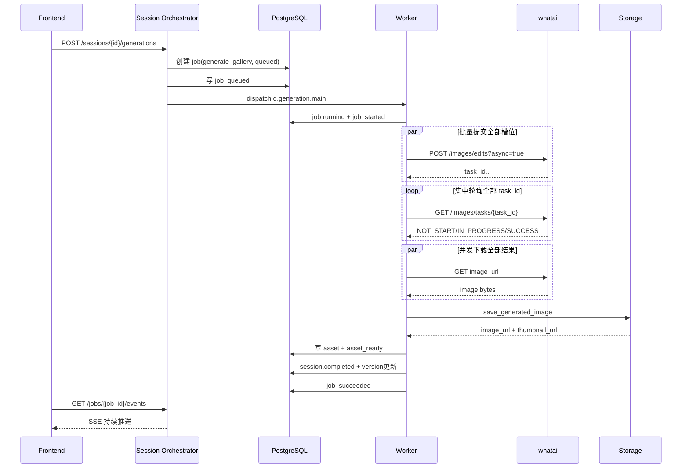
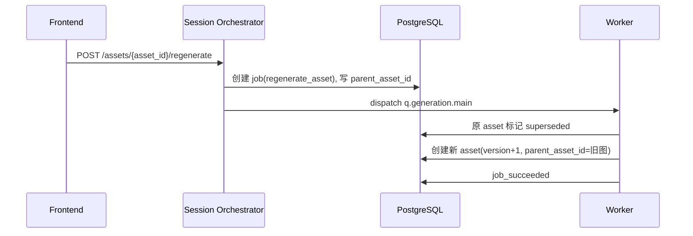

# 生图 Agent 协作逻辑（当前实现映射）

## 1. 文档定位
本文档描述的是**逻辑 Agent 协作模型**，用于指导开发、联调和排障。

说明：当前系统并未拆成多进程独立 Agent 服务，而是通过 API + Worker + Pipeline 在代码层协作执行。

## 2. Agent 拆分与代码映射
| 逻辑 Agent | 职责 | 主要代码映射 |
|---|---|---|
| Session Orchestrator | 接收请求、做前置状态校验、创建 job、分发任务 | `app/api/v2/sessions.py`, `app/api/v2/assets.py` |
| Service Principal Agent | 校验 `X-App-Key`、解析 `service_id`、隔离接入方数据访问 | `app/core/deps.py`, `app/core/actors.py` |
| LLM Router Agent | 按任务类型选择文本模型，统一屏蔽 OpenRouter / WhatAI 文本调用差异 | `app/services/llm_router.py` |
| Analysis Agent | 读取会话图片，产出 `analysis_snapshot` 与 copy 草稿 | `run_analysis_job` + `WhataiClient.analyze_images` |
| Parameter Extract Agent | 基于 `analysis + 商品图 + confirmed_copy + 可选附件` 一次性产出 Step3 最终可编辑结果 | `run_extract_parameters_job` + `WhataiClient.extract_parameters` |
| Parameter Completion Agent | 兼容保留的同步补全入口，不再属于默认 Step3 主链 | `POST /sessions/{id}/parameters/complete` + `WhataiClient.complete_parameters` |
| Copy Regen Agent | 按字段重写 copy 建议，不直接覆盖 confirmed_copy | `run_regenerate_copy_job` |
| Strategy Builder | 生成 `strategy_preview`、`reference_manifest`、`prompt_plan` 和可执行 `asset_plan` | `build_strategy_preview` |
| Main Copy Design Agent | 为主图每个槽位补充更适合上图的短标题、短副文案和参数标签 | `WhataiClient.design_main_copy_blocks` + `build_strategy_preview` |
| Detail Page Planner | 生成 `detail_strategy_preview`、商品/风格参考 manifest 和 8 个 panel 规划，并直接补齐 `copy_focus/panel_goal/visual_truth_mode/origin_note` | `build_detail_strategy_preview` |
| Prompt Composer | 按主图槽位输出结构化 prompt blocks 与最终 `final_prompt` | `compose_prompt` |
| Detail Prompt Composer | 按 panel slot 输出带字详情页 prompt blocks 与最终 `final_prompt` | `compose_detail_panel_prompt` |
| Image Generation Agent | 批量提交上游异步任务、集中轮询、并发下载图片字节 | `WhataiClient.submit_image_request/poll_image_tasks/download_image_bytes` |
| Storage/Versioning Agent | 持久化原图/结果图/缩略图，维护版本与父子关系 | `LocalStorageAdapter` + `AssetModel` |
| Prompt Debug Agent | 只读预览当前 prompt、参考图引用和最近一次真实执行快照 | `POST /sessions/{id}/prompts/preview` |
| Event & Lock Agent | 任务事件流、幂等记录、并发锁与冲突控制 | `append_job_event` + idempotency + redis lock |

## 3. 各 Agent 输入/输出与状态责任

### 3.1 Session Orchestrator
- 输入：HTTP 请求（含 session_id、asset_id、instruction、Idempotency-Key）
- 输出：`job_id` 或同步业务数据
- 状态责任：
  - 识别 `ServicePrincipal(app_id)`，资源归属统一为 `service_id`
  - 校验 session 状态与前置条件
  - 创建 `jobs` 记录（`queued`）
  - 分发到 `q.analysis` / `q.copy` / `q.generation.main` / `q.generation.detail`
- 失败处理：返回 `40002/40003/40901/40902` 等
- 重试策略：由调用端按幂等策略重试
- 详情页补充：
  - `POST /sessions/{id}/detail-pages/generations` 创建 `generate_detail_page`
  - 与主图 generation 共用同一套并发锁与冲突码 `40901/40902`
### 3.1.1 Service Principal Agent
- 输入：HTTP Header `X-App-Key`
- 输出：`ServicePrincipal(app_id)`
- 状态责任：
  - 校验接入方静态密钥
  - 将主链路资源统一绑定到 `service_id`
  - 拦截跨接入方读取他人 session/job/upload/download
- 失败处理：
  - 缺失或错误的 `X-App-Key` 返回 `40101 unauthorized`

### 3.2 Analysis Agent
- 输入：session 可用图片 + active_platform（可空）
- 输出：`analysis_snapshot`、可选 copy 草稿初始化
- 状态变更：`images_uploaded -> analyzing -> analyzed`
- 失败处理：
  - 无图时写 `job_failed` 并抛 `40008`
  - 上游异常转 `50201`
- 重试策略：上游网络级异常会先做单请求重试；若仍失败，Celery 任务最多再重试 3 次（`max_retries=3`）
- 当前实现补充：
  - LLM Router 已改为按任务显式路由：`analysis / main planner / detail planner / visual parameter extraction` 默认保持 `WhatAI + Gemini`，OpenRouter 只保留给文本辅助任务
  - 上传商品图会以内联图像内容的方式发给上游，不再依赖 `localhost` URL
  - 分析输入当前会优先走受控尺寸图片（`max_edge` 缩边），避免大图全量进内存
  - analysis / planner / parameter extraction 现在统一走 `validator -> 同模型 repair 1 次 -> fallback`，worker 不再因为轻微格式漂移直接崩溃
  - analysis freshness 现在显式落到 session：
    - `analysis_version`
    - `analysis_updated_at`
    - `latest_analysis_job_id`
  - 同一轮 analysis 的完成条件已经收口为：
    - 新 `analysis_snapshot` 落库完成
    - `reanalysis_required=false`
    - `confirmed_copy` 默认值补齐完成
    - `analysis_version / analysis_updated_at / latest_analysis_job_id` 更新完成
    - 然后 job 才允许写 `succeeded`
  - `analysis_snapshot` 包含 `reference_summary`，至少提炼主体形态、颜色、材质、结构与不可漂移点
  - `analysis_snapshot` 额外包含：
    - `analysis_source`
    - `category_candidates[{category,confidence,reason}]`
    - `scene_tags`
    - `detected_view_slots`
    - `supplement_image_recommendations[{slot_type,label,reason,priority,upload_goal,must_show,framing_hint,example_caption,image_kind?}]`
    - `reanalysis_required`
    - `provider/model/prompt_version/repair_round/source`
  - Step 2 品类识别会优先消费后台启用的“全局品类库”，而不是开放式自由猜类目
  - Step 2 的补图建议已经收口为“建议补传什么图片”，不再是抽象拍摄技巧：
    - `upload_goal` 描述要补哪块视觉信息
    - `must_show` 描述图片里必须出现的真实结构元素
    - `framing_hint` 描述建议前端如何提示用户取景
    - `example_caption` 只作为补图意图示例
    - `extra.image_kind` 当前支持 `detail_closeup / water_tank / filter_structure / size_in_hand / use_scene_real`
  - fallback 不再把 `家居用品` 当成默认结论；推不出时返回 `其他` + 弱候选列表
  - 商品图 upload/delete、`/uploads/complete` 与“切换 active_platform_id”都只会把当前分析标脏：
    - 保留旧 `analysis_snapshot`
    - 设置 `reanalysis_required=true`
    - 清空 `parameter_snapshot`
    - 清空 `strategy_preview/detail_strategy_preview`
    - 不会递增 `analysis_version`
  - 显式重跑 `POST /sessions/{id}/analysis` 时，也会先清空上一轮 `parameter_snapshot`

### 3.3 Copy Regen Agent
- 输入：`targets` + `instruction` + 当前 copy
- 输出：`generated_fields`
- 状态变更：session 进入或保持 `copy_ready`
- 失败处理：非法字段 `40004`
- 重试策略：上游网络级异常可进入 Celery 任务重试，最多 3 次

### 3.3.1 Parameter Extract Agent
- 输入：`analysis_snapshot + 当前 session 商品图 + confirmed_copy + 可选参数附件`
- 输出：`parameter_snapshot`
- 状态责任：
  - 一次性产出 Step3 页面默认展示的最终可编辑结果：
    - `hero_scene`
    - `core_selling_points`
    - `key_parameters`
    - `product_advantages`
    - `feature_highlights`
  - 无附件时仍可运行，属于 `analysis_only` 轻策划模式
  - 有附件时附件优先，属于 `attachment_backed` 模式，可整页覆盖旧的 analysis-only 结果
  - 不相关附件返回 `invalid`，但 job 仍可成功完成，供前端展示解释
  - 快照额外补充：
    - `source_mode`
    - `evidence_priority`
    - `evidence_summary`
    - `provider/model/prompt_version/source`
- Job 语义：
  - `job_type = extract_parameters`
  - 当前复用 `q.analysis` 队列

### 3.3.2 Parameter Completion Agent
- 当前实现说明：
  - 为同步接口，不创建独立 job
  - 不再属于默认前端主链
  - Step3 的产品语义已经收口为“单次 extract 出最终页”，不是 `extract -> complete` 两段式

### 3.4 Strategy Builder
- 输入：`confirmed_copy` + `active_platform_id` + session 图片 + 可选 `planner_instruction`
- 输出：`strategy_preview`（含 `asset_plan`、`reference_manifest`、`prompt_plan`）
- 状态变更：`copy_ready -> strategy_ready`
- 失败处理：copy 或平台缺失返回 `40002/40003`
- 重试策略：当前为同步接口流程，不走 Worker
- 额外约束：
  - 同一份输入会按 `input_hash` 直接复用已持久化 `strategy_preview`
  - `input_hash` 与正式构建共享同一批已加载 reference images，避免重复读图
  - `generate_gallery` 进入 worker 后，会优先复用 session 上已存在且 `input_hash` 未变化的 `strategy_preview`，不再为了正式生成再重跑一次 planner
  - 当前支持通过 `planner_profile` 切换策略预览档位：
    - `harness_first`：当前默认主/详情 planner 先走 `WhatAI + kimi-k2.5`，并对 `kimi-k2.5` 自动追加 `enable_thinking=true`；若命中 `429/超时` 再降级到 `WHATAI_PLANNER_LIGHT_MODEL`
    - `light_model`：切到更轻量的 planner 模型
  - `strategy_preview` / `detail_strategy_preview` 会记录 `planner_profile`、`planner_primary_* / planner_fallback_* / planner_attempt_count / planner_final_source`，同时 `input_hash` 也会把当前 profile/provider/model 纳入哈希
  - `Main Copy Design Agent` 当前默认关闭，不再作为主链默认时延来源
  - 主图改为“平台规则包 + 槽位计划 + 表达方式模块”
  - 默认平台固定输出 5 张主图：`hero` `white_bg` `selling_point` `scene` `detail`
  - 阿里系平台固定输出 5 个槽位：`primary_kv` `reason_why` `proof_authority` `benefit_scene_or_compare` `closing_selling_point`
  - 每个 `asset_plan` 项都带 `slot_id/slot_family/expression_mode/copy_blocks/layout_policy/proof_policy/requires_white_bg_validation/platform_rule_pack`
  - 每个 `prompt_plan` 项都带 `reference_image_ids/must_keep/must_avoid/background_rule/composition_rule/lighting_rule/fidelity_rule/final_prompt_base/rule_modules_used/resolved_constraints`
  - 当前支持在 Step 5 通过 `planner_instruction` 对整组策略做一轮额外优化
  - 当前优先让 planner 决定 `expression_mode/copy_focus/focus_selling_point/reference_image_ids`，规则包退化为 guardrail + fallback
  - `prompt_plan` / `asset_plan` 现在还会带 `global_consistency_note`：
    - 用于约束局部图和结构图必须与参考图整体结构一致
    - 如果没有内部结构证据，就不能直接生成强结构剖面图
  - 详情页 prompt 组装新增“内部规划语义 vs 可见文案”边界：
    - `panel_goal/copy_focus/planner_prompt_base/visual_truth_mode/origin_note` 只作为内部 planning context
    - 最终上图文案会过滤 `Proof/panel_goal/copy_focus/设计证明/【...】` 等规划标签，避免泄露到成图

### 3.5 Prompt Composer + Image Generation Agent
- 输入：copy、strategy、slot/role、可选 instruction、参考图
- 输出：单图结构化 prompt 预览与图片字节
- 状态变更：job `running`，逐图产出 `asset_ready`
- 失败处理：上游失败 `50202`，任务写 `job_failed`
- 限流补充：
  - 若上游返回 `429 Too Many Requests`，当前会直接写成 `rate_limited (42901)`
  - `jobs.result_payload` 会补 `upstream_http_status=429` 与 `upstream_reason=rate_limited`
  - 前端结果页应显示“上游限流”，而不是统一显示 timeout
- 重试策略：
  - 当前主图组默认优先走 `/v1/images/edits`，把参考图以 multipart 形式上传到上游
  - 当前默认图片模型为 `gemini-3.1-flash-image-preview-2k`
  - `/images/edits` 当前传 `aspect_ratio`；`/images/generations` 才传 `size`
  - 主图与详情页都采用“两阶段执行”：先批量提交全部上游异步任务，再集中轮询全部 `task_id`，最后并发下载结果
  - `/images/edits` 若在提交阶段出现传输层断连，会先做请求级重试；若仍失败，只对当前单张图做内部重试
  - 图片下载遇到传输层异常时，会做请求级重试
  - 生图链路默认不再因为 `upstream_image_error` 进入 Celery 整任务重试，避免重复消费上游额度
- 参考图选择规则：
  - 参考图优先级：`front > angle45 > side > extra`
  - `hero` / `white_bg` / `selling_point` / `scene`：优先 `front + angle45`
  - `detail`：优先 `front + side`，没有 `side` 时退回 `angle45`
  - 单个 role 最多引用 2 张参考图
- 并发规则：
  - 主图默认并发 `main_generation_concurrency=4`
  - 详情页默认并发 `detail_generation_concurrency=6`
  - 上游任务提交默认并发 `generation_submit_concurrency=6`
  - 即使内部并发执行，Asset 最终持久化顺序仍按 `display_order`
- Prompt 结构：
  - `blocks.goal`
  - `blocks.subject`
  - `blocks.composition`
  - `blocks.background`
  - `blocks.style`
  - `blocks.selling_points`
  - `blocks.constraints`
  - `blocks.instruction`
- Prompt Matrix / Harness 加固：
  - prompt 现按 `Agent Prompt / Planner Prompt / Render Prompt / Sanitize/Validation Prompt` 四层收口
  - analysis / 主图 planner / 详情页 planner / Step3 / copy regenerate 的内部提示默认统一走中文表述
  - 所有可见文案在真正进入 render prompt 前，会先经过统一 `prompt_safety` 清洗：去掉思考过程、推理标签、内部规划字段、流程说明和内部包装词
  - 当前优先策略是“清洗 / 降级 / 软补救”，而不是整链路硬拦截
- 主图 visible copy 质量门禁：
  - `copy_blocks` 在进入 `final_prompt` 前会过滤占位词、弱信息短句和假参数占位，不再把 `核心功能突出/视觉清爽/参数A 100unit` 直接透传到单图 prompt
  - 还会额外过滤 `panel_goal/copy_focus/narrative_section/origin_note/visual_truth_mode/Proof/设计证明/规则模块/布局模板/【...】/思考过程` 等内部词
  - 当高质量事实不足时，单图允许退化为少文案或仅保留产品识别标题，不强行堆砌泛口号
  - `must_keep/must_avoid` 与 planner 自由文本会先做字符拆分修复，避免 `整；体；圆；柱...` 这类异常文本继续污染 prompt
- Analysis fallback 约束：
  - `analysis_snapshot.analysis_source=fallback` 时，fallback copy 草稿不会再自动写入 `confirmed_copy`
  - fallback 分析仍保留 `reference_summary` 等弱参考信息，供策略和保真约束使用，但默认不作为主图可见文案来源
- 一期槽位约束：
  - `hero`：主体与第一卖点优先，背景简洁，不做海报拼贴
  - `white_bg`：独立白底分支，纯白无缝背景，单产品完整展示，无人物无道具无场景
  - `selling_point`：只聚焦单一卖点，不依赖图中文字
  - `scene`：强调真实使用场景，环境不抢主体
  - `detail`：强调局部结构、材质和纹理
  - `primary_kv`：阿里首图改为 `标题区 + 产品主体 + 背景结构 + 底部利益点`；主体约占半屏，底部利益点最多 2 个
  - `reason_why`：理由卡/机制卡/能力摘要；至少表达 2 个不同理由点，不允许重复角度小图凑数
  - `proof_authority`：最强卖点 + 参数/证书/面板特写/结构放大；没有真实证书素材时不伪造权威认证
  - `benefit_scene_or_compare`：消费者利益场景或对比优势；必须有颜色/光区强化视觉重点，不能做平淡白底陈列图
  - `closing_selling_point`：优质场景 + 核心卖点 + 1-2 个辅助卖点；承担尾屏总结，不是简单换背景重拍
- 阿里中文平台 visible copy 约束规则：
  - 仅 `1688` / `taobao` 触发；`alibaba_intl` 保持英文语义
  - 当前主链改回纯 prompt-first：先在策略预览和最终 prompt 中前置强化“中文短句、少字、不要英文营销词、不要内部标签”，不再在下载后追加热路径语言验收
  - 新增海报文案必须中文化，但参考图里商品本体原有英文、型号、logo、按钮字样和铭牌丝印属于保真范围，应尽量保留
  - 默认允许的 visible copy 语义仍只围绕简体中文、阿拉伯数字、必要计量单位，以及用户明确提供的商品事实
  - 若中文文案不稳定，优先少字或无字，不再为了语言审核对单图做额外补跑，避免拖慢整组生成
- 429 / EOF 鲁棒性：
  - `analysis / main_planner / detail_planner / Step3` 命中 `429` 时，先在单请求内做短退避重试，不直接进入 Celery 长退避
  - planner 若短退避后仍失败，直接回退到 rule-based/fallback，不再为了一次上游拥塞把整组主图时延拖长
  - 主图下载阶段若只有个别槽位失败，会先尝试单槽位补救；补救后仍失败时，允许当前版本以 `partial_succeeded` 落库
  - `partial_succeeded` 版本会显式记录 `missing_slot_ids`，前端可继续复用 `slot_ids` 只补缺失槽位
- 用户可编辑文案口径：
  - Step3/Step4 默认继续沿用现有编辑结构，不新增前台编辑器能力
  - 但默认可编辑值必须来自清洗后的最终候选文案，不再把内部 planning 字段直接暴露给前台
  - `copy/regenerate` 返回值同样会走文案清洗，不把思考过程或内部规划词直接回传给用户
- 白底分支额外规则：
  - 生成后执行轻量白底校验：边缘白色占比、外环白色占比、主体连通域数量
  - 白底校验不再依赖 `role == white_bg`，而依赖 `requires_white_bg_validation=true`
  - 若校验失败，只对当前槽位内部追加更强白底约束再尝试 1 次
  - 若二次仍失败，当前只做 `soft_failed` 标记，不整组打挂

### 3.5.1 Detail Page Planner + Detail Prompt Composer
- 输入：copy、商品图、可选风格图、可选 `planner_instruction`、可选本轮 `instruction`
- 输出：
  - `detail_strategy_preview`
  - 8 个 panel prompt
  - 8 张 `detail_page/panel` 资产
  - 1 张 `detail_page/stitched` 资产
- 状态责任：
  - 不改写主图 `status/current_step`
  - 独立维护 `detail_generation_round/detail_latest_result_version/latest_detail_generate_job_id`
- 当前实现约束：
  - `use_case` 固定为 `amazon_detail`
  - `aspect_ratio` 固定为 `21:9`
  - `panel_count` 固定为 `8`
  - 同一份输入会按 `input_hash` 直接复用已持久化 `detail_strategy_preview`
  - `generate_detail_page` 进入 worker 后，也会优先复用已存在且 `input_hash` 未变化的 `detail_strategy_preview`，不再为了正式生成再重跑一次详情页 planner
  - `detail_strategy_preview` 当前额外带 `detail_story_brief`
  - `panel_plan` 当前带 `slot_id/narrative_section/panel_goal/copy_focus/panel_type/panel_type_reason/candidate_panel_types/layout_template/rule_modules_used/product_reference_ids/style_reference_ids/visual_truth_mode/origin_note`
  - 详情页 planner 会显式复用同一 `session_id` 下的 `analysis_snapshot + 商品图 + parameter_snapshot`
  - 详情页链路保持独立生成，但语义上是 narrative-first，不是主图 5 槽位的复写
  - `detail_planner` 会一次性产出 `copy_focus/panel_goal/visual_truth_mode/origin_note`，不再追加默认 reviewer 二跳
  - 这样做的目的是减少详情页默认 LLM 调用数，避免策略预览为了文案 review 再额外等待一轮
  - 未上传风格图时，优先使用 `style_preset_id` 解析出的风格摘要，再拼接 `style_custom`；仅兼容回退 `style_choice`
  - 生图默认使用 1 张商品 grid；有风格图时追加 1 张 style/font grid
  - 详情页执行阶段优先消费 panel 级参考图，grid 只作为 fallback/辅助参考，不再让所有 panel 共用同一组主参考输入
- Job / 事件语义：
  - `job_type = generate_detail_page`
  - 通用事件流仍为 `job_queued/job_started/job_progress/asset_ready/job_succeeded|job_failed`
  - 当前会额外写入详情页专属阶段事件：
    - `detail_strategy_ready`
    - `detail_panel_render_started`
    - `detail_panel_render_succeeded`
    - `detail_stitched_ready`
  - `asset_ready` 会产出 9 次：8 次 panel + 1 次 stitched

### 3.6 Storage/Versioning Agent
- 输入：图片字节、session_id、round/version、role/order
- 输出：`image_url`、`thumbnail_url`、图片元数据
- 一致性规则：
  - 每次生成都新写文件，不覆盖旧文件
  - `version_no` 单调递增
  - 单图重生成写 `parent_asset_id`
  - 被替代图标记为 `superseded`
- 详情页补充：
  - `assets.asset_family` 区分 `main_gallery | detail_page`
  - `assets.asset_kind` 区分 `panel | stitched`
  - 主图与详情页各自维护独立版本号，不互相覆盖

### 3.7 Event & Lock Agent
- 输入：job 生命周期与任务上下文
- 输出：`job_events`（SSE 数据源）+ 锁控制结果
- 事件：`job_queued/job_started/job_progress/asset_ready/job_succeeded/job_failed`
- 并发规则：
  - 同 session 同时最多 1 个生图任务
  - Redis 不可用时降级到 DB 检查
  - 详情页 generation 也参与同一套互斥，不允许和主图 generation 并行

## 4. 三类 regenerate 语义对比
| 类型 | 入口 | 作用范围 | round_no | version_no | parent_asset_id |
|---|---|---|---|---|---|
| `global_edit` | `POST /sessions/{id}/results/global-edit` | 当前实现按整组重做 | +1 | +1 | 否 |
| `regenerate_gallery` | `POST /sessions/{id}/results/regenerate` | 整组重做 | +1 | +1 | 否 |
| `regenerate_asset` | `POST /assets/{id}/regenerate` | 单图重做 | 不变 | +1 | 是 |

补充：
- 当 `/assets/{id}/regenerate` 命中 `detail_page/panel` 时，内部 job_type 为 `regenerate_detail_panel`，语义同样是“局部重做 + 新版本完整物化”。
- `regenerate_asset` 与 `regenerate_detail_panel` 的 carry-forward 基线都必须取 `parent_asset.version_no`，不能直接取当前 `latest_result_version`。

## 5. 时序图

### 5.1 首次生图链路

### 5.2 全局修改链路

### 5.3 单图重生成链路

- Worker 在物化新版本时，必须从 `parent_asset.version_no` 读取 carry-forward 资产；如果用户是在历史版本上发起单图或单 panel 重生成，未改动槽位必须继续继承该历史版本。

## 6. 一致性与可追溯约束
1. Job 是唯一执行真相：任何生图动作都必须先建 job。
2. Event 可重放：前端状态应由 job + job_events 驱动。
3. 版本不可回退：`latest_result_version` 仅向前增长。
4. 父子可追溯：单图重生成必须保存 `parent_asset_id`，carry-forward 基线必须取 `parent_asset.version_no`，carry-forward 资产必须在 `generation_snapshot` 中记录 `source_asset_id/source_version_no`。
5. 失败可定位：失败必须写 `job_failed` 且带错误信息。
6. Prompt 可追溯：最终写入 `assets.prompt_snapshot` 的是实际提交给上游的 `final_prompt`。
7. 引用可追溯：`assets.generation_snapshot` 必须记录 `reference_image_ids/reference_slots/upstream_endpoint/planner_instruction/size`。
8. 槽位可追溯：主图资产需写 `slot_id/expression_mode/rule_pack_id`；详情页资产需写 `slot_id/panel_type/visual_truth_mode/origin_note`。
9. 后台资产归档不物理删除，只修改 `visibility_status` 并记录后台审计日志。

## 6.1 Prompt Debug 只读接口
- 入口：`POST /sessions/{session_id}/prompts/preview`
- 作用：
  - 查看“当前 copy + 当前平台 + 当前 instruction”算出来的 prompt
  - 查看当前计划会使用哪些参考图
  - 对比最近一版已生成资产上的 `prompt_snapshot + generation_snapshot`
- 只读约束：
  - 不创建 job
  - 不写库
  - 不请求上游生图
- 返回重点：
  - `prompts[]`：当前预览 prompt
    - 当前会额外回传 `visual_structure/copy_density/proof_mode/scene_mode/emphasis_style`
    - 当前会额外回传 `prompt_sections_used/copy_policy_applied/slot_guardrails`
  - `reference_manifest[]`：当前可用参考图清单
  - `latest_assets[]`：最近真实出图时保存的 prompt 快照与执行快照

## 7. 当前实现边界
- 当前仅实现“逻辑 Agent 协作”，不是独立 Agent 微服务编排。
- success validator、平台合规检测、自动纠偏链路尚未接入。
- `scope=selected` 的局部全局修改尚未在执行层生效（当前按整组处理）。
- 规则包运行时现在支持“DB 发布优先 + 代码 seed 兜底”；后台改规则只影响后续策略和新生成结果，不回写历史资产。
