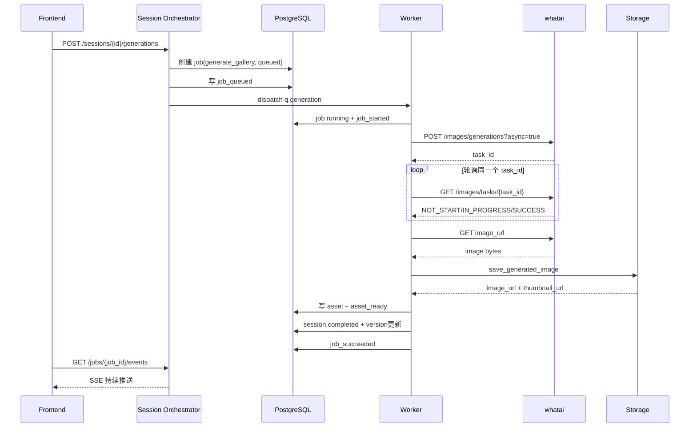
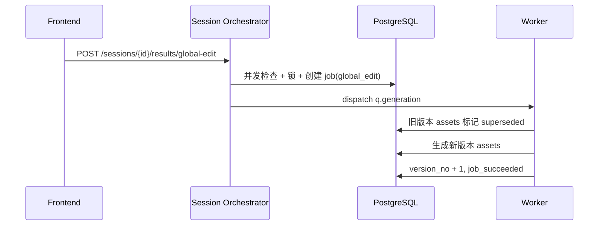
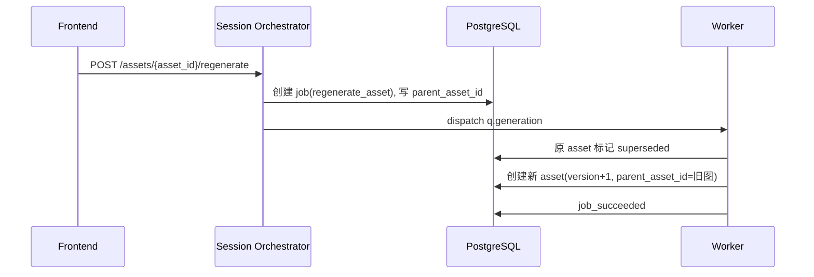

# 生图 Agent 协作逻辑（当前实现映射）

## 1. 文档定位
本文档描述的是**逻辑 Agent 协作模型**，用于指导开发、联调和排障。

说明：当前系统并未拆成多进程独立 Agent 服务，而是通过 API + Worker + Pipeline 在代码层协作执行。

## 2. Agent 拆分与代码映射
| 逻辑 Agent | 职责 | 主要代码映射 |
|---|---|---|
| Session Orchestrator | 接收请求、做前置状态校验、创建 job、分发任务 | `app/api/v2/sessions.py`, `app/api/v2/assets.py` |
| Analysis Agent | 读取会话图片，产出 `analysis_snapshot` 与 copy 草稿 | `run_analysis_job` + `WhataiClient.analyze_images` |
| Copy Regen Agent | 按字段重写 copy 建议，不直接覆盖 confirmed_copy | `run_regenerate_copy_job` |
| Strategy Builder | 生成 `strategy_preview` 和 `asset_plan` | `build_strategy_preview` |
| Prompt Composer | 按 role 组装 prompt | `compose_prompt` |
| Image Generation Agent | 调用图片上游接口，产出图片字节 | `WhataiClient.generate_image` |
| Storage/Versioning Agent | 持久化原图/结果图/缩略图，维护版本与父子关系 | `LocalStorageAdapter` + `AssetModel` |
| Event & Lock Agent | 任务事件流、幂等记录、并发锁与冲突控制 | `append_job_event` + idempotency + redis lock |

## 3. 各 Agent 输入/输出与状态责任

### 3.1 Session Orchestrator
- 输入：HTTP 请求（含 session_id、asset_id、instruction、Idempotency-Key）
- 输出：`job_id` 或同步业务数据
- 状态责任：
  - 校验 session 状态与前置条件
  - 创建 `jobs` 记录（`queued`）
  - 分发到 `q.analysis` / `q.copy` / `q.generation`
- 失败处理：返回 `40002/40003/40901/40902` 等
- 重试策略：由调用端按幂等策略重试

### 3.2 Analysis Agent
- 输入：session 可用图片 + active_platform（可空）
- 输出：`analysis_snapshot`、可选 copy 草稿初始化
- 状态变更：`images_uploaded -> analyzing -> analyzed`
- 失败处理：
  - 无图时写 `job_failed` 并抛 `40008`
  - 上游异常转 `50201`
- 重试策略：上游网络级异常会先做单请求重试；若仍失败，Celery 任务最多再重试 3 次（`max_retries=3`）

### 3.3 Copy Regen Agent
- 输入：`targets` + `instruction` + 当前 copy
- 输出：`generated_fields`
- 状态变更：session 进入或保持 `copy_ready`
- 失败处理：非法字段 `40004`
- 重试策略：上游网络级异常可进入 Celery 任务重试，最多 3 次

### 3.4 Strategy Builder
- 输入：`confirmed_copy` + `active_platform_id`
- 输出：`strategy_preview`（含 `asset_plan`）
- 状态变更：`copy_ready -> strategy_ready`
- 失败处理：copy 或平台缺失返回 `40002/40003`
- 重试策略：当前为同步接口流程，不走 Worker

### 3.5 Prompt Composer + Image Generation Agent
- 输入：copy、strategy、asset_role、可选 instruction
- 输出：单图 prompt 与图片字节
- 状态变更：job `running`，逐图产出 `asset_ready`
- 失败处理：上游失败 `50202`，任务写 `job_failed`
- 重试策略：
  - 图片生成使用 WhatAI 异步模式：先提交一次生成任务，再基于同一个 `task_id` 轮询任务结果接口拿最终图片链接
  - 当前轮询策略为 20 秒 1 次，最多 24 次，约 8 分钟；`NOT_START` 视为上游仍在排队/处理中，不会重复提交生图请求
  - 图片下载遇到传输层异常时，会做请求级重试
  - 生图链路默认不再因为 `upstream_image_error` 进入 Celery 整任务重试，避免重复消费上游额度

### 3.6 Storage/Versioning Agent
- 输入：图片字节、session_id、round/version、role/order
- 输出：`image_url`、`thumbnail_url`、图片元数据
- 一致性规则：
  - 每次生成都新写文件，不覆盖旧文件
  - `version_no` 单调递增
  - 单图重生成写 `parent_asset_id`
  - 被替代图标记为 `superseded`

### 3.7 Event & Lock Agent
- 输入：job 生命周期与任务上下文
- 输出：`job_events`（SSE 数据源）+ 锁控制结果
- 事件：`job_queued/job_started/job_progress/asset_ready/job_succeeded/job_failed`
- 并发规则：
  - 同 session 同时最多 1 个生图任务
  - 同 user 同时最多 1 个生图任务
  - Redis 不可用时降级到 DB 检查

## 4. 三类 regenerate 语义对比
| 类型 | 入口 | 作用范围 | round_no | version_no | parent_asset_id |
|---|---|---|---|---|---|
| `global_edit` | `POST /sessions/{id}/results/global-edit` | 当前实现按整组重做 | +1 | +1 | 否 |
| `regenerate_gallery` | `POST /sessions/{id}/results/regenerate` | 整组重做 | +1 | +1 | 否 |
| `regenerate_asset` | `POST /assets/{id}/regenerate` | 单图重做 | 不变 | +1 | 是 |

## 5. 时序图

### 5.1 首次生图链路

### 5.2 全局修改链路

### 5.3 单图重生成链路

## 6. 一致性与可追溯约束
1. Job 是唯一执行真相：任何生图动作都必须先建 job。
2. Event 可重放：前端状态应由 job + job_events 驱动。
3. 版本不可回退：`latest_result_version` 仅向前增长。
4. 父子可追溯：单图重生成必须保存 `parent_asset_id`。
5. 失败可定位：失败必须写 `job_failed` 且带错误信息。

## 7. 当前实现边界
- 当前仅实现“逻辑 Agent 协作”，不是独立 Agent 微服务编排。
- success validator、平台合规检测、自动纠偏链路尚未接入。
- `scope=selected` 的局部全局修改尚未在执行层生效（当前按整组处理）。
