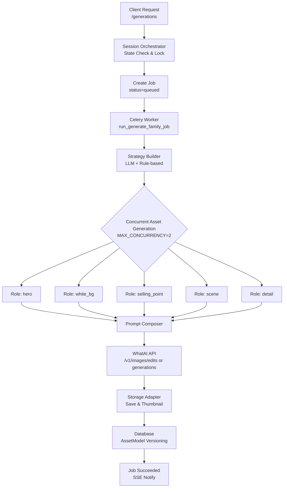
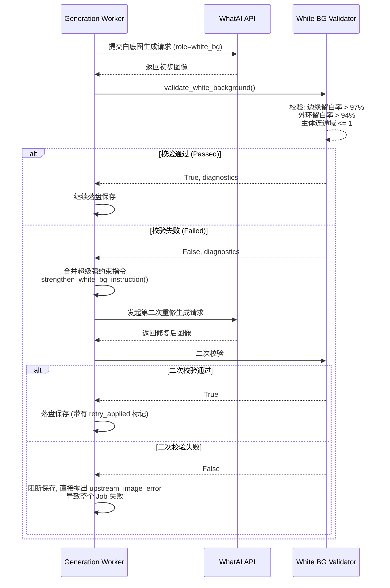
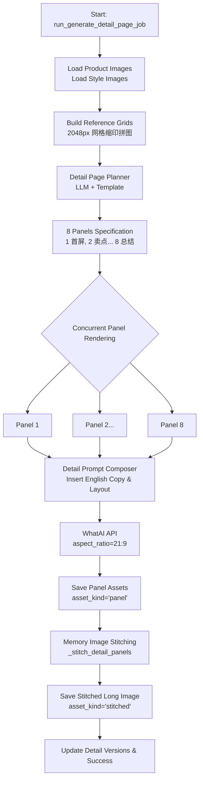

# SmartPhoto Backend v2 - 核心生图链路与系统架构技术报告

## 一、系统架构基座

SmartPhoto Backend 的生图架构分为三个关键层次，它们彼此隔离、状态统一、通过队列消费模型产生最终图像资产：

1. **HTTP / State 层 (FastAPI + SQLAlchemy)**：负责接收入参验证、处理防重放攻击 (Idempotency)、维护 `Session` 的总状态机推进。
2. **Orchestration 层 (Pipeline + Services)**：不直接处理并发网络，而是将任务持久化到 `JobModel` 和 `JobEventModel`；这是系统对上游 API 不稳定和重试提供保护的核心屏障。
3. **Execution 代理层 (Celery Worker + WhatAI)**：订阅并执行 `Analysis`、`Copy Rewrite`、`Generation` 等核心子任务。任务内部署高度并行的多线程逻辑去处理实际 AI 模型消耗。

## 二、主线核心引擎流程解析

商品生图（Main Gallery Generation）在代码中是以 `session` 生命周期贯穿始终的：



### 1. 启动与状态保护 
在 `app/services/pipeline.py -> run_generate_family_job` 中，它首先会：
- 对输入 Job 解析出对应的 Session ID，执行严格的数据库并发表锁锁定 (`Redis.lock` + 内存变量级防御 `release_locks`)。
- 执行状态机判定：当前是不是 `confirmed_copy` 完善？平台（`active_platform_id`）是否指定？若所有门禁都通过，强制让前端 `current_step_status=generating` 并发出 `job_started` 事件，以便接入层做 SSE 下发通信。

### 2. 策略引擎介入 (Strategy Plan Generation)
系统并不只是“传一句话生成”。内部集成了一个复杂的策略分配逻辑（`app/services/strategy.py`），在这个阶段：
- 解析之前用户调整好的核心文案（`copy`）、卖点。
- 将图片分为预设的 5 大固定视觉角色 (`Role`)：`hero`(首屏主图), `white_bg`(白底标准图), `selling_point`(强卖点展示), `scene`(氛围场景) 和 `detail`(工艺特写)。
- 计算 Prompt 元数据规划：调用上游规划 LLM（或触发内部 Rule-based 降级）为每一种 Role 配置独属的背景 (`background_rule`), 构图约束 (`composition_rule`), 必须保留元素 (`must_keep`) 以及剔除指令 (`must_avoid`)。
- 在此阶段中，如果系统检测到是对当前图进行“全局修图修改(global_edit)”或者是“单图的重生成（regenerate_asset）”，会标记旧有的同类图片状态变成 `superseded`（淘汰）。

### 3. 多线程并行渲染调度
生成流程具有内部并发控制机制 `_render_assets_concurrently`。为防止触发底层 API RateLimit 熔断又追求实效性：
- 默认按照最大并发数两路（`MAX_GENERATION_CONCURRENCY=2`）在 Python 内存级开辟多个线程池执行 `_render_single_asset`任务。

### 4. 角色独立渲染生成 (Single Asset Generation Context)
单个图片角色的产出过程极其紧密而精密：
- **提取图库并确定长宽比**：从历史传入的底图里挑选能供本次使用的主推参考原图。
- **动态组装 Prompt Blocks (app/services/prompts.py)**：将之前的大 `strategy_plan` 切碎成：`goal` / `subject` / `composition` / `background` / `style` / `selling_points` 等具体文本块拼接。
- **WhatAI 协同 API 提交**：
    - 若指定了外部参考图：发送到上游的 `/v1/images/edits` 图生图端点。
    - 若没有参考图要求盲生：降级发送给 `/v1/images/generations` 文生图端点。
    - **容错防闪避**：执行 `_generate_image_with_asset_retry`。因为在复杂出图环境下网络异常或短暂超时难以避免，当遇到可逆 `upstream_image_error` 时这层进行了多轮底线轮询重发策略与长连接等待（通过封装的 `_poll_image_generation_task`），防止一次超时就造成了整个大 `Job` 的血崩失败。

### 5. 单点防御：`White Background` 强校验与修复能力



如果目前正在生成的是角色为 **"white_bg" (纯净白底)** 的特殊需求，`pipeline` 里藏着一个核心业务逻辑挂载点：
```python
if role == "white_bg":
    passed, diagnostics = validate_white_background(image_bytes)
    if not passed:
        retry_instruction = _merge_instructions(instruction, strengthen_white_bg_instruction())
        # 重修机制发力：内部追加超级约束重算prompt，再跑一次渲染。
```
校验代码使用了 Python 原生 `PIL (Pillow)` 和一套算法（`app/services/white_bg.py`），检查边缘留白和绝对容差。如果初次大模型幻觉了，AI 强行把底色“泛灰”，算法会阻断它持久化，往后注入类似 `不要加特效和模糊` 修改指令并原地强制再生成一回，极大提升了结果下限。

### 6. 持久化定版归档
所有的字节流产出最终流向：
- **存块与缩略图**：使用 `LocalStorageAdapter` (或者支持扩展后的 S3) 落盘图片实体并且进行不同体积级别的尺寸裁切与降质缩略处理。
- **存记录与代代相传版本序列**：生成 ORM SQLAlchemy 对象 `AssetModel` 入库。关键属性如 `version_no + 1`, `prompt_snapshot`(用于溯源追踪它是基于什么文本被画出来的), 以及所属家谱 (`asset_family='main_gallery'`) 被全量保留并下放数据库持久存储。
- 会话最终进度设为了结束（`state: completed`），触发成功的 WebSocket/SSE 通知流 `job_succeeded` 收尾动作。

## 三、亚马逊特供分支：Detail Page 详情页组的架构演进



除了传统的 5 张电商橱柜主图，系统还在最近（V2架构升级）引入了一套重型子任务系统：**商品详情展示长图（Detail Page Panel Generations）**。其本质是生图架构为了“连续性图文组排版”做的一次极致优化：

- **分离式策略构建**：`pipeline` 中新开了一类专用入口 `run_generate_detail_page_job`，不再生成散乱的主图 Role 而是按固定的 **8 套版式结构** （Panel 1~8: 从 `首屏强主图` 到 `第二卖点` 再到 `结构剖面特写` 最后 `底栏总结`）。
- **图片双参考与 LLM 对齐**：与主图逻辑截然不同，它采用了“合并九宫格”参考系逻辑（参见 `_build_reference_grid_image` 函数）；先把用户提供的多张核心原图，直接通过 Pillow 暴力网格化合成为一整张 2048px 的“参考缩印巨图”。这种压缩参考法既省大模型 Token（或参考图数量上限限制），又能让大模型一次性“纵览”整体结构。
- **图文混排版式组装**：生成的图片不再是正方形 1:1，而是长条带字广告长图画幅比例 `21:9`（`aspect_ratio_1792x768`），并且 AI 对提示词的要求加入了强烈的“文本预留和图文排版骨格占位”提示。
- **渲染缝合手术刀**：这是最具魅力的一点，当所有的 `asset_kind=panel` （子切片画面）以多线程全部独立就位落盘后，会在最后通过 `_stitch_detail_panels` 内存操作合并出一整张从头到尾纵向级联的网页长图（属于 `asset_kind=stitched`），供客户一键式部署或切图上架使用。这期间同样共用了 `Supersede` 版本隔离系统，防止详情修图污染了传统纯净主图库的资产链表。

## 四、安全与故障监控链路总结

- **HTTP SSE 响应流**：前后端解耦通过 `GET /jobs/{job_id}/events` 查询，实现了无阻塞界面的“流水线式的动画展现”；
- **重试容载**：为了克制生图 API 的不可靠，我们在 `Job 代理层（重发队列、Worker自身 3 级重发机制）` 与 `Image Pool 级（内部断线续查与轮询锁重发）` 做双向拦截。这极大幅度降低了重跑整个巨额成本的计算任务发生频率。
- **并发锁逃逸杜绝**：所有带有强事务生成性质的生成，通过 Redis 和 Database 双重强绑定 `lock_keys` 防止连续暴击。
