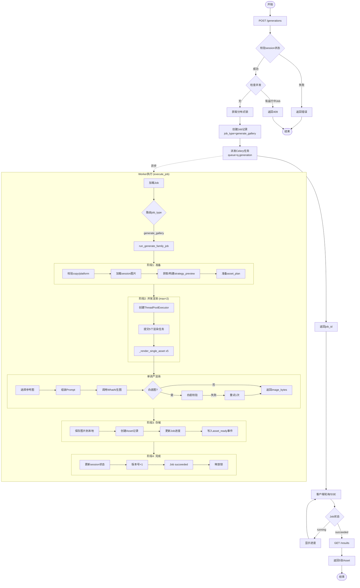
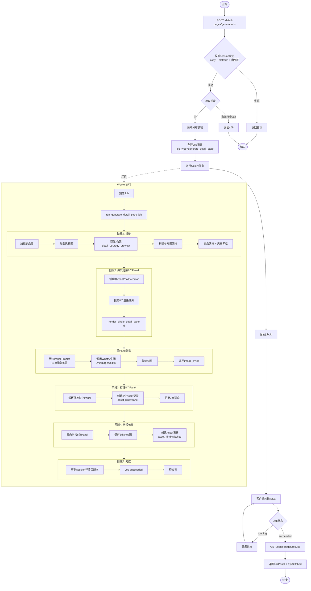
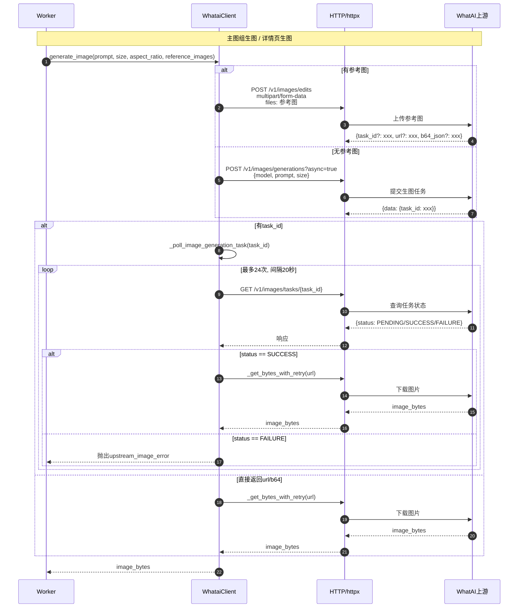
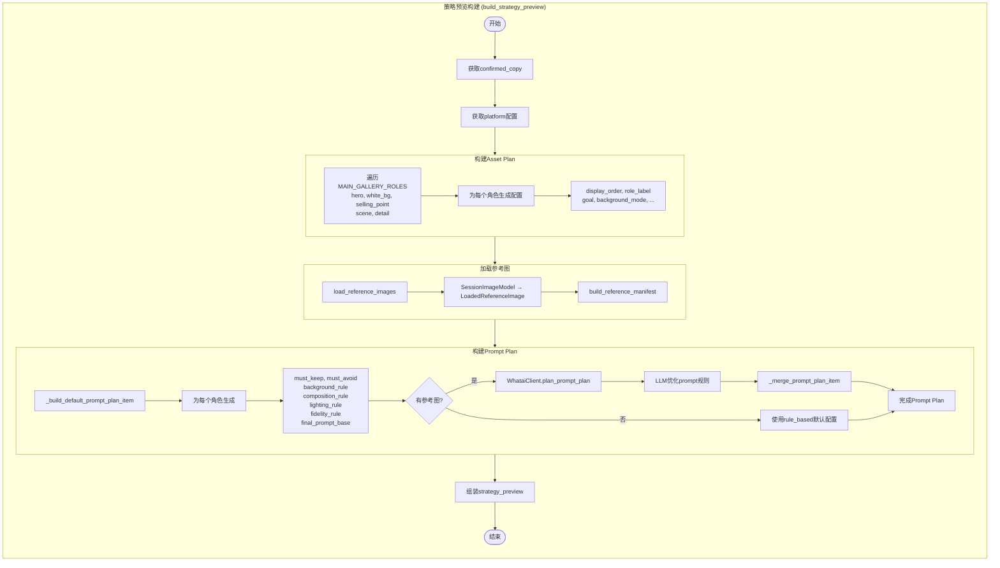
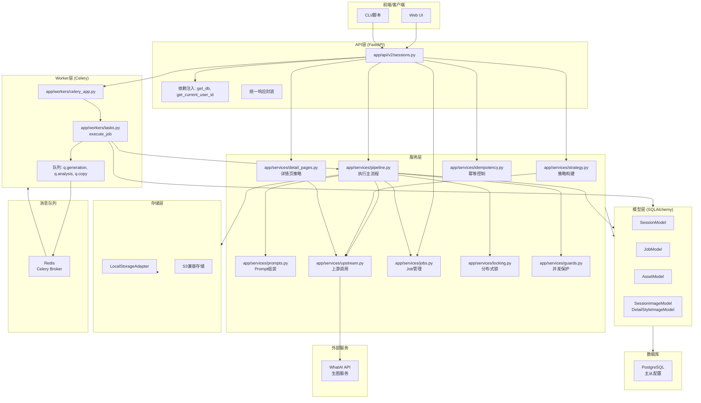

# SmartPhoto Backend 生图流程文档

## 目录
1. [概述](#概述)
2. [主图组生图流程](#主图组生图流程)
   - [技术流程](#主图组技术流程)
   - [逻辑流程](#主图组逻辑流程)
3. [详情页生图流程](#详情页生图流程)
   - [技术流程](#详情页技术流程)
   - [逻辑流程](#详情页逻辑流程)
4. [Mermaid流程图](#mermaid流程图)

---

## 概述

SmartPhoto Backend 支持两种生图流程：

1. **主图组生图** (`main_gallery`): 生成5张不同角色的电商主图
   - 角色: hero(主图), white_bg(白底图), selling_point(卖点图), scene(场景图), detail(细节图)
   - 默认比例: 1:1 (1024x1024)
   - 输出: 5张panel图

2. **详情页生图** (`detail_page`): 生成8张Amazon详情页panel + 1张拼接长图
   - 固定8个panel: 首屏总览、产品概览、卖点一、卖点二、场景展示、细节工艺、参数信息、收束总结
   - 比例: 21:9 (1792x768)
   - 输出: 8张panel图 + 1张stitched长图

---

## 主图组生图流程

### 主图组技术流程

#### 1. API入口层 (`app/api/v2/sessions.py`)

```
POST /api/v2/sessions/{session_id}/generations
    ↓
1. 校验session状态 (strategy_ready/completed)
2. 并发检查 ensure_no_running_generation_jobs()
3. 获取分布式锁 acquire_generation_locks()
4. 幂等检查 check_or_create_idempotency()
5. 创建Job记录 create_job()
6. 派发任务 dispatch_job(job.id, queue="q.generation")
```

#### 2. 任务调度层 (`app/workers/tasks.py`)

```
Celery Worker (queue="q.generation")
    ↓
execute_job(job_id)
    ↓
根据 job_type 路由:
    - "generate_gallery" → run_generate_family_job()
    - "regenerate_gallery" → run_generate_family_job()
    - "global_edit" → run_generate_family_job()
    - "regenerate_asset" → run_generate_family_job()
```

#### 3. 业务执行层 (`app/services/pipeline.py`)

```
run_generate_family_job(db, job_id)
    ↓
【阶段1: 准备阶段】
├── 校验 confirmed_copy, active_platform_id
├── 状态机转换 ensure_session_transition() → "generating"
├── 加载session图片 _session_images()
├── 加载策略预览 _ensure_generation_strategy_preview()
│   └── 若无缓存，调用 build_strategy_preview()
└── 准备资产计划 _prepare_assets_plan()
    ↓
【阶段2: 并发渲染】_render_assets_concurrently()
├── 创建ThreadPoolExecutor (max_workers=2)
├── 提交5个异步任务 _render_single_asset()
│   └── 每个角色独立渲染
└── 收集渲染结果
    ↓
【阶段3: 单资产渲染】_render_single_asset()
├── 选择参考图 select_reference_images_for_role()
├── 组装Prompt compose_prompt()
│   └── 调用 app/services/prompts.py
├── 调用生图 _generate_image_with_asset_retry()
│   └── WhataiClient.generate_image()
│       ├── 有参考图 → /v1/images/edits (带参考图)
│       └── 无参考图 → /v1/images/generations
│   └── 白底图特殊处理: validate_white_background()
│       └── 失败则重试 strengthen_white_bg_instruction()
└── 生成generation_snapshot
    ↓
【阶段4: 存储与记录】
├── 保存图片 storage.save_generated_image()
├── 创建Asset记录 (asset_family="main_gallery", asset_kind="panel")
├── 更新Job进度 update_job_status()
├── 写入事件 append_job_event("asset_ready")
└── 重复5次(每个角色)
    ↓
【阶段5: 完成处理】
├── 更新session状态 → "completed"
├── 更新版本号 generation_round++, latest_result_version++
├── 更新Job状态 → "succeeded"
├── 写入事件 append_job_event("job_succeeded")
└── 释放锁 release_locks()
```

#### 4. 策略构建层 (`app/services/strategy.py`)

```
build_strategy_preview(confirmed_copy, active_platform_id, ...)
    ↓
├── _build_asset_plan(aspect_ratio)
│   └── 生成5个角色的asset_plan
├── load_reference_images(session_images)
├── build_reference_manifest(loaded_images)
└── _build_prompt_plan() [核心]
    ├── _build_default_prompt_plan_item() [规则兜底]
    │   └── 按角色生成: must_keep, must_avoid, background_rule, 
    │       composition_rule, lighting_rule, fidelity_rule, final_prompt_base
    └── 若存在参考图:
        └── WhataiClient.plan_prompt_plan() [LLM增强]
            └── 调用上游LLM优化prompt_plan
            └── _merge_prompt_plan_item() 合并LLM结果
```

#### 5. Prompt组装层 (`app/services/prompts.py`)

```
compose_prompt(confirmed_copy, strategy_preview, asset_role, ...)
    ↓
├── 获取角色规格 get_prompt_role_spec(role)
├── 获取prompt计划 find_prompt_plan_item(strategy_preview, role)
├── 组装8个block:
│   ├── goal: _compose_goal_block()
│   ├── subject: _compose_subject_block()
│   ├── composition: _compose_composition_block()
│   ├── background: _compose_background_block()
│   ├── style: _compose_style_block()
│   ├── selling_points: _compose_selling_points_block()
│   ├── constraints: _compose_constraints_block()
│   └── instruction: _compose_instruction_block()
├── format_prompt_blocks() 拼接最终prompt
└── 收集使用的字段 _collect_strategy_fields_used()
```

#### 6. 上游生图层 (`app/services/upstream.py`)

```
WhataiClient.generate_image(prompt, size, aspect_ratio, reference_images)
    ↓
├── 有reference_images?
│   ├── YES → _submit_image_edit()
│   │   └── POST /v1/images/edits
│   │   └── 上传参考图文件 multipart/form-data
│   │   └── aspect_ratio校验
│   └── NO → _submit_image_generation_task()
│       └── POST /v1/images/generations (async=true)
│       └── 获取task_id
    ↓
├── 有task_id?
│   └── _poll_image_generation_task()
│       └── 轮询 GET /v1/images/tasks/{task_id}
│       └── 最多24次，每次间隔20秒 (约8分钟)
└── 获取结果 (url 或 b64_json)
    ↓
_download_image(url)
    ↓
返回 image_bytes
```

---

### 主图组逻辑流程

#### 完整业务流

```
┌─────────────────────────────────────────────────────────────────┐
│                        Step 1-5: 前置准备                         │
│  ├─ 上传商品图 (session_images)                                   │
│  ├─ 分析商品 (analysis_job) → analysis_snapshot                   │
│  ├─ 选择平台 (platform_selection)                                 │
│  ├─ 编辑文案 (confirmed_copy)                                     │
│  └─ 策略预览 (strategy_preview)                                   │
│      ├─ asset_plan: 5个角色的输出规划                              │
│      ├─ prompt_plan: 每个角色的prompt规划                         │
│      └─ reference_manifest: 参考图清单                             │
└─────────────────────────────────────────────────────────────────┘
                            ↓
┌─────────────────────────────────────────────────────────────────┐
│                     Step 6: 触发整组生图                          │
│  POST /sessions/{id}/generations                                 │
│  ├─ 参数: instruction (可选的修改指令)                             │
│  └─ 幂等键: Idempotency-Key (可选)                                │
└─────────────────────────────────────────────────────────────────┘
                            ↓
┌─────────────────────────────────────────────────────────────────┐
│                         Job执行流程                               │
│  1. 状态检查: session必须处于 strategy_ready/completed            │
│  2. 并发保护: 检查无运行中的生图Job                                  │
│  3. 获取分布式锁: Redis锁防止重复提交                               │
│  4. 创建Job记录: job_type="generate_gallery"                      │
│  5. 派发Celery任务: queue="q.generation"                          │
└─────────────────────────────────────────────────────────────────┘
                            ↓
┌─────────────────────────────────────────────────────────────────┐
│                        Worker执行流程                              │
│  run_generate_family_job()                                       │
│  ├─ 状态流转: session.status → "generating"                       │
│  ├─ 策略检查: 若无strategy_preview则实时构建                         │
│  ├─ 并发渲染: 5个角色，最大并发2个                                   │
│  │   ├─ 每个角色独立组装prompt (参考strategy_preview)                │
│  │   ├─ 上传参考图到上游 (最多2张)                                   │
│  │   ├─ 调用WhatAI生图 (/v1/images/edits 或 /v1/images/generations)│
│  │   ├─ 轮询获取结果 (最多8分钟)                                    │
│  │   └─ 白底图额外校验 (失败重试1次)                                 │
│  ├─ 保存结果: 本地存储 + Asset记录                                  │
│  ├─ 版本管理: generation_round++, latest_result_version++         │
│  └─ 状态流转: session.status → "completed"                        │
└─────────────────────────────────────────────────────────────────┘
                            ↓
┌─────────────────────────────────────────────────────────────────┐
│                           输出结果                                 │
│  ├─ 5张Asset记录 (asset_family="main_gallery")                    │
│  │   ├─ asset_role: hero/white_bg/selling_point/scene/detail      │
│  │   ├─ asset_kind: panel                                         │
│  │   ├─ version_no: 递增版本号                                     │
│  │   ├─ prompt_snapshot: 最终使用的prompt                         │
│  │   └─ generation_snapshot: 完整的生成参数                        │
│  └─ Job事件流: job_queued → job_started → [asset_ready x5]        │
│                → job_succeeded                                    │
└─────────────────────────────────────────────────────────────────┘
```

#### 角色定义

| 角色 | role_label | 背景模式 | 主要用途 |
|------|-----------|----------|---------|
| hero | 主图 | studio | 首图展示 |
| white_bg | 白底图 | pure_white | 标准白底 |
| selling_point | 卖点图 | functional | 突出卖点 |
| scene | 场景图 | real_scene | 使用场景 |
| detail | 细节图 | clean | 材质细节 |

---

## 详情页生图流程

### 详情页技术流程

#### 1. API入口层 (`app/api/v2/sessions.py`)

```
POST /api/v2/sessions/{session_id}/detail-pages/generations
    ↓
1. 校验session状态 (需有confirmed_copy, active_platform_id, session_images)
2. 并发检查 ensure_no_running_generation_jobs()
3. 幂等检查 check_or_create_idempotency()
4. 获取分布式锁 acquire_generation_locks()
5. 创建Job记录 create_job(job_type="generate_detail_page")
6. 派发任务 dispatch_job(job.id, queue="q.generation")
```

#### 2. 任务调度层 (`app/workers/tasks.py`)

```
execute_job(job_id)
    ↓
job_type == "generate_detail_page"
    ↓
run_generate_detail_page_job(db, job_id)
```

#### 3. 业务执行层 (`app/services/pipeline.py`)

```
run_generate_detail_page_job(db, job_id)
    ↓
【阶段1: 准备阶段】
├── 校验 confirmed_copy, active_platform_id
├── 加载商品图 _session_images()
├── 加载风格图 _detail_style_images() (可选)
├── 构建/获取策略 _ensure_detail_strategy_preview()
│   └── 调用 app/services/detail_pages.py build_detail_strategy_preview()
└── 构建参考图网格 build_detail_reference_grids()
    ├── 商品网格 (必传)
    └── 风格网格 (可选)
    ↓
【阶段2: 并发渲染8个Panel】_render_detail_panels_concurrently()
├── 创建ThreadPoolExecutor (max_workers=2)
├── 提交8个异步任务 _render_single_detail_panel()
└── 收集渲染结果
    ↓
【阶段3: 单Panel渲染】_render_single_detail_panel()
├── 组装Prompt compose_detail_panel_prompt()
│   └── 调用 app/services/detail_pages.py
├── 调用生图 _generate_image_with_asset_retry()
│   └── 固定使用 /v1/images/edits (带参考图网格)
│   └── aspect_ratio="21:9", size="1792x768"
└── 生成generation_snapshot (包含panel特定信息)
    ↓
【阶段4: 存储8个Panel】
├── 循环保存每个panel
│   ├── storage.save_generated_image()
│   ├── Asset记录 (asset_family="detail_page", asset_kind="panel")
│   ├── 更新Job进度
│   └── append_job_event("asset_ready")
    ↓
【阶段5: 拼接长图】
├── _stitch_detail_panels()
│   └── PIL.Image 竖向拼接8张panel
│   └── 输出 stitched 长图
├── 保存长图 storage.save_generated_image()
├── Asset记录 (asset_family="detail_page", asset_kind="stitched")
└── append_job_event("asset_ready")
    ↓
【阶段6: 完成处理】
├── 更新session: detail_generation_round++, detail_latest_result_version++
├── 更新Job状态 → "succeeded"
├── append_job_event("job_succeeded")
└── 释放锁 release_locks()
```

#### 4. 详情页策略层 (`app/services/detail_pages.py`)

```
build_detail_strategy_preview(confirmed_copy, product_images, style_images, ...)
    ↓
├── 加载并处理参考图
│   ├── load_reference_images(product_images) → product_loaded
│   └── load_reference_images(style_images) → style_loaded
├── 构建参考图清单
│   ├── build_reference_manifest(product_loaded) → product_manifest
│   └── build_reference_manifest(style_loaded) → style_manifest
├── 构建默认Panel计划 _build_default_panel_plan()
│   └── 基于confirmed_copy生成8个panel的基础配置
│   └── 使用DETAIL_PANEL_SPECS定义的角色
├── 构建参考图网格 build_detail_reference_grids()
│   ├── _build_reference_grid_image(product_loaded) → product_grid
│   └── _build_reference_grid_image(style_loaded) → style_grid (可选)
├── LLM优化Panel计划 (若配置API Key)
│   └── WhataiClient.plan_detail_page_panels()
│       └── 上传商品网格 + 风格网格到LLM
│       └── 返回优化后的panel_plan
├── _merge_panel_plan() 合并LLM结果
└── 返回完整的detail_strategy_preview
    ├─ use_case: "amazon_detail"
    ├─ aspect_ratio: "21:9"
    ├─ panel_count: 8
    ├─ product_reference_manifest
    ├─ style_reference_manifest
    ├─ style_summary
    └─ panel_plan: [8个panel配置]

compose_detail_panel_prompt(confirmed_copy, strategy_preview, panel_id, ...)
    ↓
├── 获取panel配置 find_detail_panel_plan_item()
├── 组装Prompt Blocks
│   ├── goal: planner_prompt_base
│   ├── subject: 商品主体描述
│   ├── layout: layout_notes
│   ├── text: copy_lines
│   ├── style: style_summary + reference_rule
│   ├── constraints: Amazon详情页约束
│   └── instruction: 额外指令
└── format_prompt_blocks() 拼接最终prompt
```

#### 5. 8个Panel定义

```python
DETAIL_PANEL_SPECS = [
    {"panel_id": "panel_01_cover",     "panel_label": "首屏总览",   "layout_notes": "单屏强主视觉，突出标题和第一卖点"},
    {"panel_id": "panel_02_overview",  "panel_label": "产品概览",   "layout_notes": "横向信息排布，主产品完整清晰"},
    {"panel_id": "panel_03_feature_a", "panel_label": "卖点一",     "layout_notes": "围绕单一核心卖点构图"},
    {"panel_id": "panel_04_feature_b", "panel_label": "卖点二",     "layout_notes": "补充第二卖点，保留强对比"},
    {"panel_id": "panel_05_scene",     "panel_label": "场景展示",   "layout_notes": "展示使用场景，但画面主体仍是商品"},
    {"panel_id": "panel_06_detail",    "panel_label": "细节工艺",   "layout_notes": "局部特写或结构剖面"},
    {"panel_id": "panel_07_specs",     "panel_label": "参数信息",   "layout_notes": "保留参数/要点排版空间"},
    {"panel_id": "panel_08_closing",   "panel_label": "收束总结",   "layout_notes": "统一强调产品价值和整体质感"},
]
```

---

### 详情页逻辑流程

```
┌─────────────────────────────────────────────────────────────────┐
│                     Step 1-5: 前置准备 + 风格图                     │
│  ├─ 完成主图组的Step 1-5                                         │
│  ├─ 上传详情页风格图 (可选, detail_style_images)                    │
│  │   └─ 用于控制字体、配色、设计风格                                │
│  └─ 构建详情页策略预览 (detail_strategy_preview)                   │
│      ├─ 固定输出8个panel规划                                       │
│      ├─ 生成商品参考图网格 (4张商品图拼接)                           │
│      ├─ 生成风格参考图网格 (4张风格图拼接, 可选)                      │
│      └─ LLM优化每个panel的prompt和copy                              │
└─────────────────────────────────────────────────────────────────┘
                            ↓
┌─────────────────────────────────────────────────────────────────┐
│                   Step 6+: 触发详情页生图                           │
│  POST /sessions/{id}/detail-pages/generations                     │
│  ├─ 参数: instruction (可选的修改指令)                             │
│  └─ 幂等键: Idempotency-Key (可选)                                │
└─────────────────────────────────────────────────────────────────┘
                            ↓
┌─────────────────────────────────────────────────────────────────┐
│                         Job执行流程                               │
│  1. 检查session状态: 需有confirmed_copy, active_platform_id        │
│  2. 检查商品图: 至少1张session_images                              │
│  3. 并发保护 + 分布式锁                                            │
│  4. 创建Job: job_type="generate_detail_page"                      │
│  5. 派发Celery任务                                                │
└─────────────────────────────────────────────────────────────────┘
                            ↓
┌─────────────────────────────────────────────────────────────────┐
│                      Worker执行流程                                │
│  run_generate_detail_page_job()                                  │
│  ├─ 策略检查: 若无detail_strategy_preview则实时构建                  │
│  ├─ 构建参考图网格: 商品图网格(必传) + 风格图网格(可选)                │
│  ├─ 并发渲染: 8个panel，最大并发2个                                 │
│  │   ├─ 每个panel独立组装prompt (21:9横向布局)                      │
│  │   ├─ 上传参考图网格到上游                                        │
│  │   ├─ 调用WhatAI生图 (/v1/images/edits)                          │
│  │   │   └─ 固定参数: aspect_ratio="21:9", size="1792x768"         │
│  │   └─ 轮询获取结果                                               │
│  ├─ 保存8个panel                                                  │
│  │   └─ Asset记录: asset_kind="panel"                             │
│  ├─ 拼接长图: 竖向拼接8张panel                                      │
│  │   └─ Asset记录: asset_kind="stitched"                          │
│  └─ 版本管理: detail_generation_round++, detail_latest_result_version++
└─────────────────────────────────────────────────────────────────┘
                            ↓
┌─────────────────────────────────────────────────────────────────┐
│                           输出结果                                 │
│  ├─ 8张Panel Asset (asset_family="detail_page")                   │
│  │   ├─ asset_role: panel_01_cover ~ panel_08_closing             │
│  │   ├─ asset_kind: panel                                         │
│  │   ├─ aspect_ratio: 21:9                                        │
│  │   └─ size: 1792x768                                            │
│  ├─ 1张Stitched Asset (长图拼接)                                   │
│  │   ├─ asset_role: detail_page_long                              │
│  │   └─ asset_kind: stitched                                      │
│  └─ Job事件流: job_queued → job_started → [asset_ready x9]        │
│                → job_succeeded                                    │
└─────────────────────────────────────────────────────────────────┘
```

---

## Mermaid流程图

### 主图组生图流程图



### 详情页生图流程图



### 上游生图调用流程



### 策略预览构建流程



### 完整系统架构图



---

## 关键配置参数

### 并发与性能

```python
# app/services/pipeline.py
MAX_GENERATION_CONCURRENCY = 2  # 最大并发渲染数
ASSET_RENDER_ATTEMPTS = 3       # 单个资产重试次数

# app/services/upstream.py
WHATAI_REQUEST_TIMEOUT_SECONDS = 90  # 单次上游请求超时（JSON / multipart 共用）
IMAGE_TASK_POLL_ATTEMPTS = 24           # 轮询最大次数
IMAGE_TASK_POLL_INTERVAL_SECONDS = 20   # 轮询间隔
IMAGE_EDIT_REQUEST_ATTEMPTS = 4         # 编辑请求重试次数
```

### 图片规格

```python
# 主图组
ASPECT_RATIO = "1:1"      # 默认比例
IMAGE_SIZE = "1024x1024"  # 默认尺寸
ROLES = ["hero", "white_bg", "selling_point", "scene", "detail"]

# 详情页
DETAIL_PAGE_ASPECT_RATIO = "21:9"      # 固定比例
DETAIL_PAGE_IMAGE_SIZE = "1792x768"    # 固定尺寸
DETAIL_PAGE_PANEL_COUNT = 8            # 固定panel数
```

### 状态流转

```
主图组:
created → images_uploaded → analyzing → analyzed → platform_selected → copy_ready → strategy_ready → generating → completed

详情页:
基于主图组的completed状态，独立维护:
detail_generation_round, detail_latest_result_version
```

---

## 事件流示例

### 主图组生图事件流

```json
[
  {"event": "job_queued", "job_id": "job_xxx"},
  {"event": "job_started", "job_id": "job_xxx"},
  {"event": "job_progress", "progress": 3, "stage": "preparing"},
  {"event": "job_progress", "progress": 20, "stage": "generating"},
  {"event": "asset_ready", "asset_id": "asset_1", "display_order": 1},
  {"event": "asset_ready", "asset_id": "asset_2", "display_order": 2},
  {"event": "asset_ready", "asset_id": "asset_3", "display_order": 3},
  {"event": "asset_ready", "asset_id": "asset_4", "display_order": 4},
  {"event": "asset_ready", "asset_id": "asset_5", "display_order": 5},
  {"event": "job_progress", "progress": 90, "stage": "finalizing"},
  {"event": "job_succeeded", "job_id": "job_xxx"}
]
```

### 详情页生图事件流

```json
[
  {"event": "job_queued", "job_id": "job_xxx"},
  {"event": "job_started", "job_id": "job_xxx"},
  {"event": "job_progress", "progress": 3, "stage": "preparing"},
  {"event": "asset_ready", "asset_id": "panel_1", "panel_id": "panel_01_cover"},
  {"event": "asset_ready", "asset_id": "panel_2", "panel_id": "panel_02_overview"},
  // ... 8个panel
  {"event": "job_progress", "progress": 90, "stage": "stitching"},
  {"event": "asset_ready", "asset_id": "stitched_1", "asset_kind": "stitched"},
  {"event": "job_succeeded", "job_id": "job_xxx"}
]
```

---

## 错误码与处理

| 错误码 | 场景 | 处理策略 |
|-------|------|---------|
| upstream_image_error | WhatAI生图失败 | 单资产重试3次，失败后Job标记failed |
| upstream_llm_error | WhatAI分析/规划失败 | Celery级别重试3次，指数退避 |
| 40901 | 并发冲突：已有运行中Job | 返回409，客户端等待后重试 |
| 40902 | 幂等键重复 | 返回缓存结果 |
| 40008 | 缺少必要图片 | 立即失败，不触发Job |
| invalid_session_status | Session状态不允许 | 返回400，提示先完成前置步骤 |

---

## 文件目录说明

```
app/
├── api/v2/sessions.py          # API路由层
├── services/
│   ├── pipeline.py             # 核心业务流
│   ├── strategy.py             # 主图组策略
│   ├── detail_pages.py         # 详情页策略
│   ├── prompts.py              # Prompt组装
│   ├── upstream.py             # 上游服务调用
│   ├── jobs.py                 # Job管理
│   ├── locking.py              # 分布式锁
│   ├── guards.py               # 并发保护
│   ├── idempotency.py          # 幂等控制
│   ├── storage.py              # 存储适配
│   └── reference_images.py     # 参考图处理
├── workers/
│   ├── tasks.py                # Celery任务
│   └── celery_app.py           # Celery配置
└── models/
    ├── session.py              # Session模型
    ├── job.py                  # Job模型
    ├── asset.py                # Asset模型
    ├── session_image.py        # 商品图模型
    └── detail_style_image.py   # 风格图模型
```

---

## 总结

本文档详细描述了SmartPhoto Backend的生图流程，包括：

1. **主图组生图**: 5张不同角色的电商主图，支持参考图驱动，单图最大并发2张
2. **详情页生图**: 8张21:9 panel + 1张拼接长图，固定布局，支持商品参考图和风格参考图

核心设计特点：
- **异步Job**: 所有生图操作异步化，支持SSE/轮询获取进度
- **并发控制**: 全局分布式锁 + 单session并发限制
- **幂等设计**: 支持Idempotency-Key防止重复提交
- **版本管理**: generation_round和version_no实现结果版本追溯
- **策略驱动**: strategy_preview集中管理生成策略，支持规则+LLM混合优化
- **事件可观测**: 完整的Job事件流，支持实时监控
