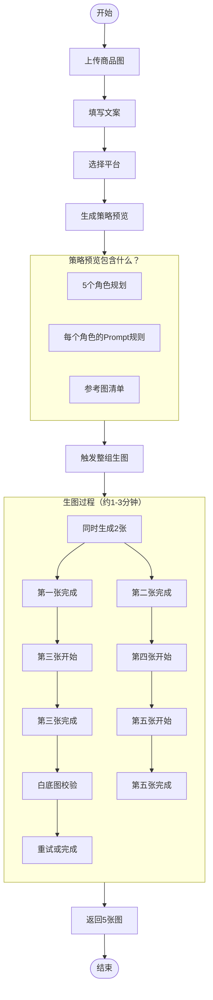
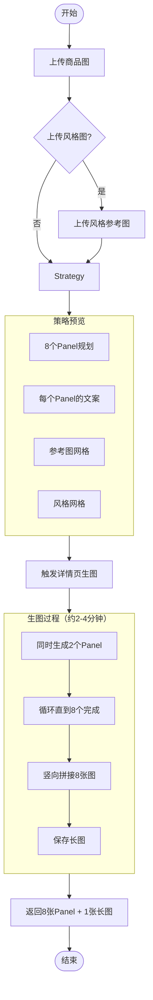
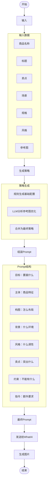

# SmartPhoto 生图流程说明


---

## 目录
1. [什么是生图？](#什么是生图)
2. [两种生图模式](#两种生图模式)
3. [主图组生图逻辑](#主图组生图逻辑)
4. [详情页生图逻辑](#详情页生图逻辑)
5. [提示词策略](#提示词策略)
6. [参考图的作用](#参考图的作用)
7. [常见问题](#常见问题)

---

## 什么是生图？

**生图 = 用 AI 根据商品信息生成营销图片**

用户上传商品实物图后，系统会：
1. 分析商品特征（颜色、材质、结构等）
2. 根据用户填写的文案（标题、卖点、场景等）
3. 自动生成适合电商平台的商品图

---

## 两种生图模式

| 对比项 | 主图组 | 详情页 |
|-------|-------|--------|
| **用途** | 商品列表展示图 | 详情页长图 |
| **输出数量** | 5 张 | 8 张 + 1 张拼接长图 |
| **图片比例** | 1:1（正方形） | 21:9（超宽横图） |
| **参考图** | 商品图（必传） | 商品图（必传）+ 风格图（可选） |
| **每张图角色** | 不同：主图/白底/卖点/场景/细节 | 不同：首屏/概览/卖点/场景/细节/参数等 |

---

## 主图组生图逻辑

### 整体流程

```
用户上传商品图 → 填写文案 → 选择平台 → 生成策略 → 触发生图 → 获得5张图
```

### 为什么生成5张图？

每个电商平台（Temu/Amazon等）的商品主图位置通常需要5张不同角色的图片，各司其职：

| 角色 | 作用 | 特点 |
|-----|-----|-----|
| **主图** | 第一张，吸引点击 | 突出商品整体，光线立体 |
| **白底图** | 平台要求的标准图 | 纯白背景，无人物道具 |
| **卖点图** | 展示核心卖点 | 突出功能部位 |
| **场景图** | 展示使用场景 | 真实环境，商品清晰 |
| **细节图** | 展示材质工艺 | 局部特写，质感清晰 |

### 生图顺序

默认顺序：**主图 → 白底图 → 卖点图 → 场景图 → 细节图**

这个顺序符合电商平台的上传规范，也符合用户的浏览习惯。

### 并发控制

系统会**同时生成2张图**，而不是5张一起。为什么？

- WhatAI 上游限制：参考图生图有并发限制
- 质量控制：避免上游过载导致质量下降
- 成本优化：合理利用上游资源

### 重试机制

- 单张图失败会**自动重试3次**
- 白底图有特殊校验：如果背景不是纯白，会**自动重试1次**并加强提示词
- 如果3次都失败，Job 会标记为失败，不会无限等待

---

## 详情页生图逻辑

### 什么是详情页？

详情页是商品详情展示的长图，通常包含8个板块，最终拼接成一张长图。

### 8个板块分工

```
┌─────────────────────────────────────────┐
│  Panel 1: 首屏总览                        │ ← 吸引注意，主标题+第一卖点
├─────────────────────────────────────────┤
│  Panel 2: 产品概览                        │ ← 完整展示商品，横向布局
├─────────────────────────────────────────┤
│  Panel 3: 卖点一                          │ ← 核心卖点A特写
├─────────────────────────────────────────┤
│  Panel 4: 卖点二                          │ ← 核心卖点B展示
├─────────────────────────────────────────┤
│  Panel 5: 场景展示                        │ ← 使用场景，环境自然
├─────────────────────────────────────────┤
│  Panel 6: 细节工艺                        │ ← 材质、纹理、做工特写
├─────────────────────────────────────────┤
│  Panel 7: 参数信息                        │ ← 规格参数展示空间
├─────────────────────────────────────────┤
│  Panel 8: 收束总结                        │ ← 整体质感，收尾
└─────────────────────────────────────────┘
           ↓ 拼接 ↓
    一张竖向长图（用于上传详情页）
```

### 与主图组的区别

| 对比 | 主图组 | 详情页 |
|-----|-------|--------|
| 布局 | 每张独立 | 8张拼成一张长图 |
| 参考图用法 | 单张引用 | 先拼成网格再引用 |
| 风格控制 | 主要靠文案 | 可上传风格参考图 |
| 文案来源 | 用户填写的卖点 | 基于卖点自动拆分 |

### 风格参考图（可选）

用户可以额外上传**风格参考图**（最多4张），用于控制：
- 字体风格
- 配色方案
- 排版布局
- 整体设计调性

如果不上传，系统会根据用户选择的风格（现代简约/科技感等）自动生成。

---

## 提示词策略

### 什么是提示词（Prompt）？

提示词就是告诉 AI "画什么" 的自然语言描述。好的提示词能让 AI 生成更符合预期的图片。

### 我们的提示词怎么生成的？

不是简单拼接，而是**结构化组装**：

```
最终提示词 = 目标 + 主体 + 构图 + 背景 + 风格 + 卖点 + 约束 + 额外指令
```

### 每个角色的提示词差异

同一个商品，不同角色的提示词侧重点不同：

#### 主图（Hero）
```
目标：高转化电商主图
主体：商品完整展示，突出核心卖点
背景：简洁高级，轻微摄影棚氛围
约束：不要复杂场景，不要人物道具
```

#### 白底图（White Background）
```
目标：标准电商白底图
主体：单个商品，完整展示外观
背景：纯白无缝背景，光线均匀
约束：不要人物、手模、家具、装饰性道具
      不要做成海报图或场景图
```

#### 卖点图（Selling Point）
```
目标：聚焦表达核心卖点
主体：围绕卖点做近景/中近景
背景：最少辅助元素，服务卖点表达
约束：不要多宫格、拼贴式海报
```

#### 场景图（Scene）
```
目标：展示真实使用感
主体：商品自然置入使用场景
背景：真实环境，但不能喧宾夺主
约束：背景不要过度复杂，商品必须清晰
```

#### 细节图（Detail）
```
目标：展示材质与做工
主体：局部特写，微距表现
背景：简洁或轻微虚化
约束：不要使用远景，不要让场景抢占主体
```

### 保真规则（Must Keep）

为了防止 AI "画跑偏"，每个角色都有强制的保真要求：

- **外形保真**：轮廓、比例、结构必须贴近参考图
- **颜色保真**：主色、辅色、明暗关系保持一致
- **材质保真**：按真实材质表达，不臆造
- **结构保真**：开孔、按钮、接口、边缘必须一致

### 禁止事项（Must Avoid）

全局禁止：
- 不要生成海报文字、标题字、角标、贴纸
- 不要出现水印、logo、边框、拼贴 UI
- 不要出现无关产品、重复主体

角色特定：
- 白底图：禁止人物、道具、场景元素
- 卖点图：禁止多宫格拼贴
- 场景图：禁止背景过度复杂
- 细节图：禁止远景、场景信息抢占

### 策略优化（LLM 增强）

如果有参考图，系统会：

1. **先用规则生成基础配置**（保底）
2. **再用 LLM 分析参考图并优化**（智能增强）
3. **合并两者**，取 LLM 好的部分，保留规则必要的部分

例如，LLM 可能会：
- 推荐更适合的背景规则
- 调整构图建议
- 优化光线描述
- 指出必须保留的特征

---

## 参考图的作用

### 为什么需要参考图？

AI 生成图片是基于概率的，没有参考图很容易：
- 商品外形跑偏
- 颜色不对
- 结构错误
- 比例失调

参考图的作用是**锚定商品特征**，让 AI 知道 "要画的是这个"。

### 参考图怎么用？

#### 主图组
- 用户上传的商品图直接作为参考
- 每张生图时最多引用2张参考图
- 系统会选择最相关的角度（正面/45度/侧面）

#### 详情页
- 先把所有商品图拼成一个 **2x2 网格**
- 生图时引用这个网格作为整体参考
- 如果有风格图，也会拼成网格一起引用

### 参考图网格示意

```
┌──────────┬──────────┐
│  图1     │  图2     │
│ (正面)   │ (45度)   │
├──────────┼──────────┤
│  图3     │  图4     │
│ (侧面)   │ (额外)   │
└──────────┴──────────┘
      ↓
   生成网格图
   作为整体参考上传
```

这样 AI 能看到商品的多角度信息，生成的图更保真。

---

## 常见问题

### Q: 为什么有时候生成的图不像我的商品？

可能原因：
1. **参考图质量**：上传的参考图角度太少、光线太差、背景太乱
2. **参考图数量**：建议上传3-6张不同角度的图
3. **保真冲突**：卖点/场景图为了突出效果，可能会适度调整视角，但主体特征会保持

### Q: 白底图为什么总是校验失败？

可能原因：
1. AI 生成时加入了环境元素（阴影、反光等）
2. 背景不够 "纯白"（有灰度或颜色倾向）

系统会**自动重试1次**并加强提示词，但如果仍然失败会报错。

### Q: 详情页的风格参考图有什么用？

风格参考图可以控制：
- 字体样式和排版
- 配色方案（主色/辅色）
- 整体设计风格（简约/复古/科技等）
- 视觉元素的运用

如果不传，系统会根据你选择的风格自动生成。

### Q: 生图可以并发吗？

- **主图组**：5张图，同时生成2张，总共3个批次
- **详情页**：8张图，同时生成2张，总共4个批次
- **不同 Session**：可以并发，互不影响
- **同一 Session**：不能并发（防止冲突）

### Q: 为什么需要等8分钟？

生图流程：
1. 提交任务（秒级）
2. WhatAI 生成（通常30-120秒）
3. 轮询结果（最多8分钟兜底）

大部分任务在1-2分钟内完成，8分钟是超时保护。

### Q: 可以修改某一张图吗？

可以：
- **单张重生成**：选择某张图重新生成（保持其他不变）
- **全局修改**：对整组图提修改要求（如 "换成暖色调"）
- **详情页单Panel**：可以重新生成单个 Panel

### Q: 提示词可以自定义吗？

系统会自动生成完整的提示词，但用户可以：
- **Step 5 策略预览**：添加 "Planner Instruction" 影响策略
- **生图时**：添加 "Instruction" 影响本次生成
- **全局修改**：通过文字描述告诉系统要修改什么

不建议直接编辑提示词，因为系统会基于策略自动优化。

---

## 流程图

### 主图组生图流程



### 详情页生图流程



### 提示词组装流程



---

## 总结

SmartPhoto 的生图设计遵循以下原则：

1. **平台适配**：不同平台、不同角色有不同的生成策略
2. **参考图驱动**：以用户上传的商品图为保真锚点
3. **结构化提示词**：不是简单拼接，而是模块化的策略组装
4. **智能优化**：规则保底 + LLM 增强，兼顾稳定和智能
5. **质量保障**：白底图校验、自动重试、超时保护
6. **可观测性**：完整的事件流，实时反馈进度

理解这些逻辑，有助于更好地使用产品，也有助于排查问题。
